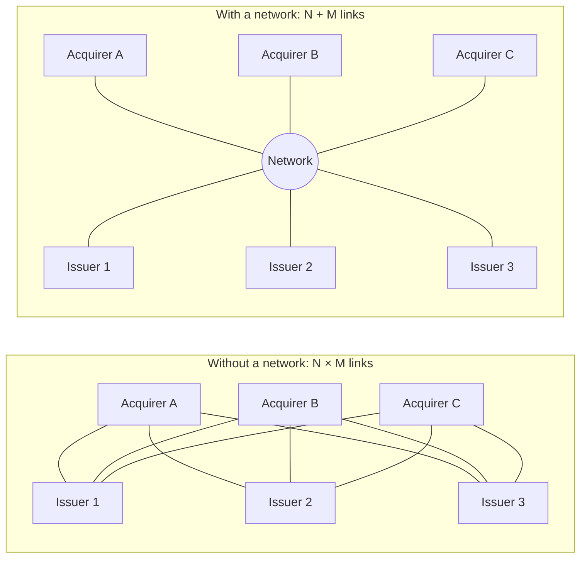
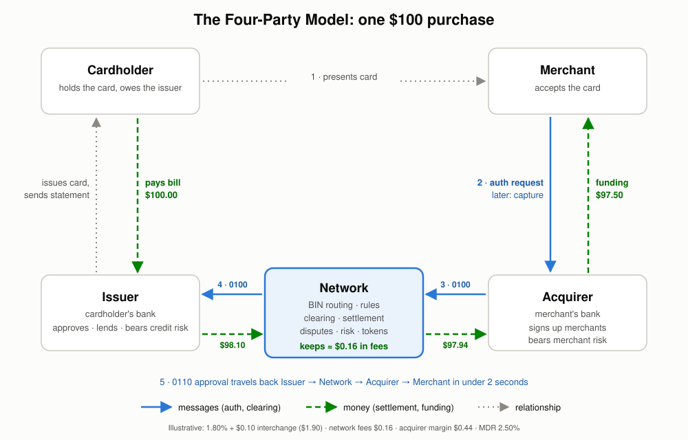
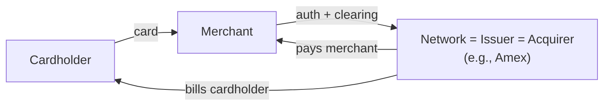

# 01: What Is a Card Network?

## The one-sentence definition

A card network is a **switch and a rulebook**. The switch routes payment messages between thousands of banks that have no direct relationship. The rulebook makes them trust each other enough to move money based on those messages.

Without a network, every merchant's bank would need a bilateral contract and a technical link with every cardholder's bank. That is N × M connections. With a network, each bank connects once and agrees to one set of rules. That is N + M connections.

At real scale (thousands of issuers and thousands of acquirers in about 200 countries), the bilateral model is impossible. **This network effect is the moat.** Cardholders carry the card because merchants accept it, and merchants accept it because cardholders carry it.

## The four-party model (Visa, Mastercard, and `simple-network`)

| Party | Relationship | Holds the risk of |
|---|---|---|
| **Cardholder** | Customer of the issuer | Owes the issuer for purchases |
| **Issuer** | Licensed by the network to issue cards | Cardholder credit risk and fraud on its cards |
| **Merchant** | Customer of the acquirer | Delivering what was paid for |
| **Acquirer** | Licensed by the network to sign up merchants | Merchant risk: bankruptcy, fraud, unpaid chargebacks |
| **Network** | Licenses issuers and acquirers, runs the switch | Settlement risk, if a member bank fails (mitigated by collateral) |

The network has **no direct relationship** with cardholders or merchants. It only deals with member banks (and the processors that act for them). Visa and Mastercard do not lend money, set your APR, or approve your purchase. Your issuing bank does all of that.

## The three-party model (American Express, Discover, Diners)

In a **closed loop** the network is also the issuer and, usually, the acquirer.

| | Four-party (open loop) | Three-party (closed loop) |
|---|---|---|
| Examples | Visa, Mastercard, UnionPay, RuPay | American Express, Discover (historically), Diners Club |
| Who issues | Thousands of member banks | Mostly the network itself |
| Revenue | Small per-transaction fees on huge volume | The full merchant discount, plus card fees and interest |
| Data | Network sees transaction data, issuer sees the cardholder | Sees both sides: full-loop data |
| Growth lever | Sign up more banks | Sign up cardholders and merchants directly |
| Regulation | Interchange is often capped (EU, US debit) | Often outside interchange caps, because there is no "interchange" |

Lines blur in practice. Amex and Discover have licensed third-party issuers and acquirers (for example, Amex OptBlue lets acquirers sign up small merchants). Capital One bought Discover in 2025 partly to move its own card volume onto a network it owns.

**`simple-network` is four-party.** That is a good choice: it forces you to build the switch, the routing, the multi-party settlement, and the rulebook, which are the parts that make a network a network.

## What a network does

| Function | Description | Where it's covered |
|---|---|---|
| **Routing (switching)** | Gets each authorization to the right issuer in milliseconds, using the BIN | [04](04-authorization-deep-dive.md), [07](07-cards-bins-and-tokens.md) |
| **Message standards** | Defines the exact message format everyone uses (ISO 8583 variants) | [04](04-authorization-deep-dive.md) |
| **Clearing** | Exchanges final transaction records and matches them to authorizations | [05](05-clearing-and-settlement.md) |
| **Settlement** | Computes net positions and instructs funds movement between banks | [05](05-clearing-and-settlement.md) |
| **Fee engine** | Calculates interchange and network fees for every transaction | [06](06-economics-and-fees.md) |
| **Dispute management** | Runs chargebacks, representments, and arbitration | [08](08-exceptions-and-disputes.md) |
| **Risk services** | Fraud scoring, stand-in processing, tokenization, authentication directory | [09](09-risk-fraud-and-security.md), [11](11-network-products-and-services.md) |
| **Rules and compliance** | Writes the rulebook, licenses members, fines violators | [10](10-rules-governance-and-regulation.md) |
| **Brand** | The logo on the card and at the checkout: a guarantee of acceptance | [10](10-rules-governance-and-regulation.md) |

## What a network does NOT do

New builders often put these in the network by mistake. Each one belongs to someone else.

| Not the network's job | Whose job |
|---|---|
| Deciding whether to approve a purchase | Issuer (the network decides only in stand-in) |
| Holding cardholder balances, credit limits, statements, APR, rewards | Issuer (or its processor) |
| Holding merchant accounts and paying merchants | Acquirer (or its processor) |
| Signing up merchants or running KYC on them | Acquirer, PayFac, or ISO |
| Running card terminals or checkout pages | Merchant, gateway, or acquirer |
| Holding funds between auth and settlement | Nobody. Money moves only at settlement |

For `simple-network`, this means the **switch service must never read or write the issuer's account database**. The PLAN's rule that "no component reads another component's data directly" is the right boundary.

## A short history (why things look the way they do)

| Year | Event | Legacy you will see in the design |
|---|---|---|
| 1950 | Diners Club: the first general-purpose charge card | Three-party model |
| 1958 | Bank of America launches BankAmericard in Fresno | Bank-issued revolving credit |
| 1966 | Interbank Card Association (later Mastercard) forms | Bank cooperatives as networks |
| 1970s | BankAmericard becomes Visa; electronic authorization (BASE I) replaces phone calls | The dual-message system: online auth plus batch clearing |
| 1987 | ISO 8583 first published | The message format still used today |
| 1990s | EMV chip standard (Europay, Mastercard, Visa) | Chip cryptograms, DE55 |
| 2004 | PCI DSS formed from the brands' separate security programs | Security rules for anyone touching card data |
| 2006–2008 | Mastercard (2006) and Visa (2008) IPO; they stop being bank-owned cooperatives | Networks become for-profit companies, under antitrust scrutiny |
| 2010 | Durbin Amendment caps US debit interchange | Regulated vs unregulated interchange tables |
| 2014 | Apple Pay; EMVCo tokenization specification | Network tokens, Token Service Providers |
| 2015 | US EMV liability shift; EU caps interchange (IFR) | Liability shift rules |
| 2016+ | 3-D Secure 2, real-time push payments (Visa Direct, Mastercard Send) | Card rails used for payouts, not only purchases |

The **dual-message design** is the most important legacy. Online authorization was added to an existing paper-batch clearing process, and that split is still how credit cards work. It explains why a hotel can hold $300 and later charge $412, and why your pending charge disappears and returns as a posted charge. See [03](03-transaction-lifecycle.md).

## Key takeaways

- A network is a switch plus a rulebook that lets thousands of banks trust each other.
- Four-party networks earn small fees on huge volume. Three-party networks earn the full spread but must build both sides themselves.
- Keep the network's job narrow: route, standardize, clear, settle, set rules, manage risk. Approving, lending, and paying merchants belong to the banks.

Next: [02: Participants and Roles](02-participants-and-roles.md)
