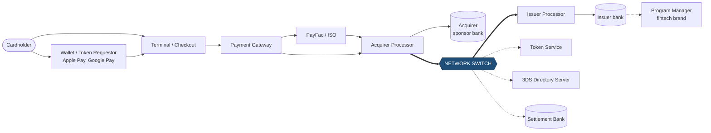
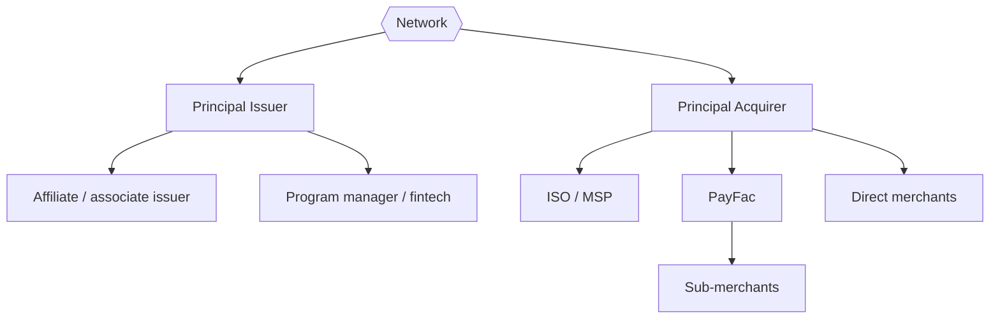

# 02: Participants and Roles

The textbook four-party model leaves out most of the companies that actually touch a transaction. A real swipe can pass through eight or more systems. Knowing each one tells you which interfaces your network must expose and to whom.

Thick arrows are the network's own interfaces. Dotted lines are services the network also runs or connects to.

## Core members

### Issuer
The bank that issues the card and extends credit (or holds the deposit account, for debit).
- **Owns:** the cardholder relationship, the credit limit, balances, holds, statements, interest, rewards, and the final approve or decline decision.
- **Interfaces with the network:** receives authorization requests (`0100`), sends responses (`0110`), receives clearing files, pays into settlement, starts chargebacks.
- **Earns:** interchange, interest, annual fees, late fees.
- **Main risks:** credit losses and fraud on its cards.

### Acquirer (merchant bank)
The bank that signs up merchants and gives them access to card payments.
- **Owns:** the merchant relationship, underwriting, the merchant's MCC, payouts to the merchant, and responsibility for merchant behavior.
- **Interfaces with the network:** sends authorization requests, sends the clearing batch, receives settlement funds, answers chargebacks.
- **Earns:** the merchant discount rate minus interchange and network fees.
- **Main risks:** **merchant liability**. If a merchant takes prepayments, goes bankrupt, and its customers charge back, the acquirer pays. This is why acquirers hold reserves and underwrite carefully.

### Network (scheme / brand)
- **Owns:** the switch, the rules, the BIN registry, the fee schedules, dispute arbitration, settlement calculation, and the brand.
- **Earns:** assessment fees (a small percentage of volume) plus per-transaction processing fees, from **both** issuers and acquirers.
- **Main risks:** settlement risk (a member bank failing before it pays), outages, and regulators.

## Processors and intermediaries

| Role | What it does | Examples (real world) | Why it matters to you |
|---|---|---|---|
| **Issuer processor** | Runs the authorization host, card database, and ledgers for issuers | TSYS, Fiserv, FIS, Marqeta, Galileo, Lithic | Your network will often talk to a processor, not the bank itself. Certify processors once, and many issuers can join. |
| **Acquirer processor** | Runs the acquiring host and connects merchants to the network | Fiserv, Worldpay, Global Payments, Elavon | Same as above, on the acquiring side |
| **Payment gateway** | Takes card data from websites and apps and forwards it to the processor | Stripe, Adyen, Braintree, Authorize.net | Gateways create most e-commerce traffic. They care about tokenization and 3DS. |
| **PayFac (payment facilitator)** | A master merchant that signs up many sub-merchants under one acquirer | Stripe, Square, Shopify Payments | Must pass the sub-merchant's identity in auth messages (DE43 / sub-merchant fields) |
| **ISO / MSP** | Sells merchant accounts on behalf of an acquirer | Thousands of small sales firms | Registered with the network through the acquirer |
| **Program manager** | A fintech that designs a card product while a bank is the licensed issuer | Many neobank cards | The BIN belongs to the sponsor bank, not the fintech |
| **BIN sponsor / sponsor bank** | The licensed member that lends its membership to a non-bank | Banks like Sutton, Evolve, Cross River | Network rules apply through the sponsor |
| **Token requestor** | Asks the network for a token in place of the PAN | Apple Pay, Google Pay, merchants with card-on-file | Uses your Token Service APIs |
| **Settlement bank** | Holds settlement accounts and moves funds when the network instructs | A central settlement bank (in the US, moves funds over Fedwire) | Your settlement engine outputs instructions to it |

## Who is a "member"?

Only licensed **principal members** (usually regulated banks) connect to the network's rulebook directly. Everyone else participates through a member:

**Design lesson:** your participant registry needs a hierarchy. A member owns BINs (issuing side) or acquirer IDs (acquiring side). It has endpoints, keys, a settlement account, and a set of agents (processors, PayFacs) that act for it. Liability always goes up to the principal member.

## Identifiers each party carries

| Identifier | Who assigns it | Who uses it | ISO 8583 field |
|---|---|---|---|
| BIN / IIN (6–8 digits) | Network (from ISO-registered ranges) | Routing to the issuer | Part of DE2 (PAN) |
| Acquirer ID (AIIN / acquiring BIN / ICA) | Network | Routing responses and clearing to the acquirer | DE32 |
| Forwarding institution ID | Network | Identifies the processor that sent the message | DE33 |
| Merchant ID (MID) | Acquirer | Identifies the merchant | DE42 |
| Terminal ID (TID) | Acquirer | Identifies the device | DE41 |
| Merchant name / city / country | Merchant / acquirer | Cardholder statements, risk checks | DE43 |
| MCC (merchant category code) | Acquirer, following network rules | Fees, risk, restrictions | DE18 |
| STAN | Sender, per message | Matching within one link and one day | DE11 |
| RRN | Acquirer | Matching across the whole lifecycle | DE37 |
| Auth code | Issuer (or stand-in) | Proof of approval at clearing | DE38 |
| Network transaction ID | Network | One global ID across the full lifecycle | Private fields (e.g., Visa Transaction ID) |

**Design lesson:** generate a **network transaction ID** for every authorization and send it back to both sides. Clearing, reversals, disputes, and stored-credential follow-ups should all reference it. Matching on STAN and RRN alone gets fragile fast.

## Key takeaways

- A network's customers are banks and their processors, not shoppers and stores.
- Liability goes up the hierarchy to the principal member. Your registry must model that.
- Most real integration work is with processors and gateways. Clear specs and a good certification sandbox are part of the product.

Next: [03: Transaction Lifecycle](03-transaction-lifecycle.md)
