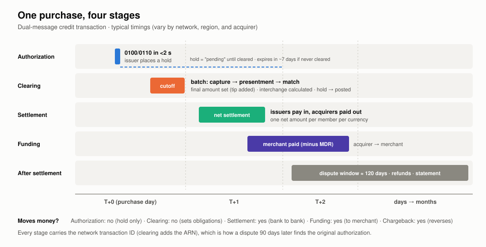
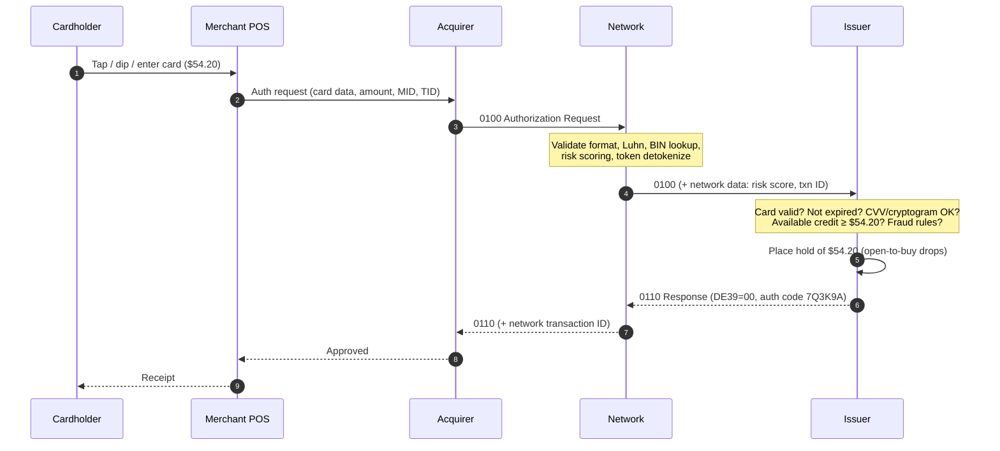
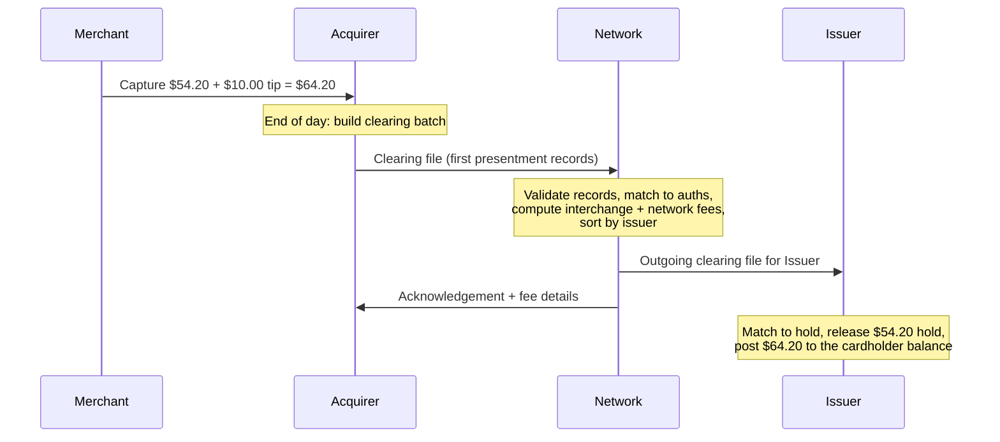
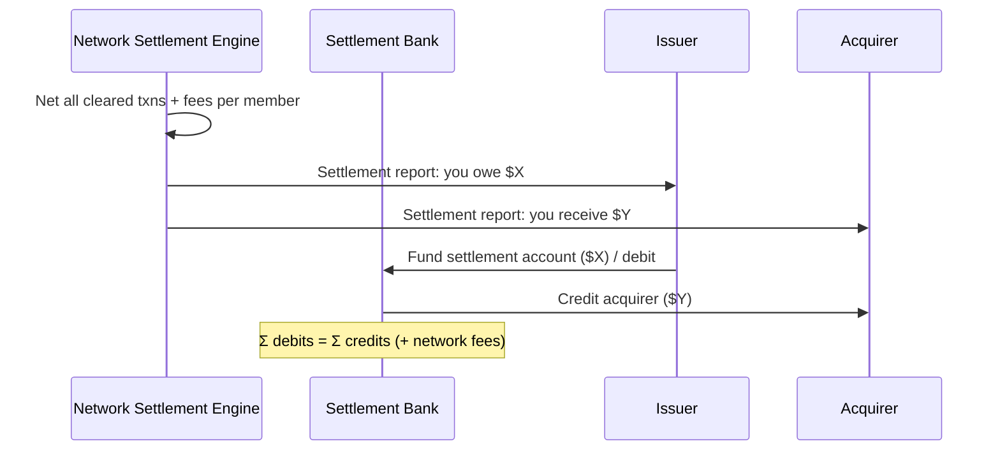
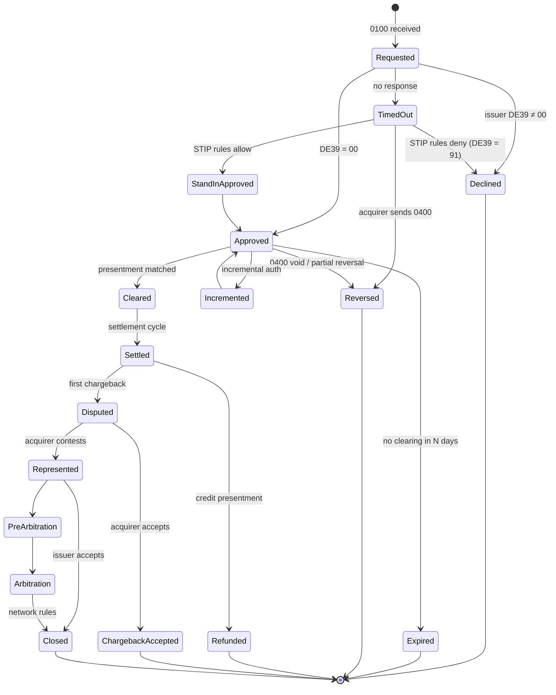

# 03: Transaction Lifecycle

Every card purchase goes through four stages. They happen at different times, on different systems, and each one can fail on its own.

| Stage | When | Speed | Mode | Moves money? |
|---|---|---|---|---|
| **1. Authorization** | At checkout | Under 2 seconds end to end | Real-time, one message at a time | No. The issuer places a hold. |
| **2. Clearing** | Usually end of day, after capture | Hours (batch cycles) | Batch files | No. It sets the final amounts owed. |
| **3. Settlement** | Usually T+1 | Scheduled windows | Net totals per bank | **Yes.** Banks move funds. |
| **4. Funding** | T+1 to T+3 | Depends on the acquirer | Acquirer to merchant | **Yes.** The merchant gets paid. |

Then come the **post-settlement** events: refunds, chargebacks, and the cardholder's statement and payment.

## Stage 1: Authorization

What happens at the end:
- The **issuer** has a hold. Available credit is down $54.20, but nothing is posted to the balance yet. The cardholder sees a "pending" charge.
- The **merchant** has an approval code and the right to submit this transaction for payment.
- The **network** has logged the request and response, and may have charged a small per-auth fee.
- **No money has moved.**

## Stage 2: Capture and clearing

Capture is the merchant's decision to ask for the money. At a restaurant, capture happens after the tip is added. At an online store, it happens when the item ships. The acquirer collects captured transactions into a **clearing (presentment) file**.

Points to remember:
- The cleared amount **can differ** from the authorized amount (tips, hotel incidentals, split shipments, fuel). Network rules set tolerances. For example, a restaurant tip is allowed within a percentage of the auth amount.
- Interchange is calculated at **clearing**, not at authorization, because it depends on final data: the amount, how fast the merchant captured, which data was supplied, and whether the auth was matched.
- An authorization that never clears **expires**. The issuer drops the hold after a set period (often around 7 days for most merchants, longer for hotels and car rentals).
- A transaction that clears **without** a matching auth is allowed in some cases (below floor limits, offline chip transactions), but it usually gets worse interchange and weaker chargeback protection.

## Stage 3: Settlement

The network adds up each member's cleared transactions and fees into one **net position** per member per settlement currency. Then it tells the settlement bank to move the funds.

See [05](05-clearing-and-settlement.md) for a full multi-bank netting example.

## Stage 4: Merchant funding

The acquirer pays the merchant: gross sales, minus the **merchant discount rate** (MDR), minus refunds, chargebacks, and reserves. This happens outside the network. Some acquirers pay gross and bill fees monthly. Others pay net daily.

## Dual-message vs single-message

| | Dual-message | Single-message |
|---|---|---|
| Messages | Auth (`0100`) plus separate clearing record | One financial message (`0200`) that both authorizes and clears |
| Typical use | Credit, signature debit, e-commerce | PIN debit, ATM |
| Amount can change after auth? | Yes | No (an adjustment needs a separate message) |
| Hold period | Days | None. The money is posted immediately. |
| Real-world examples | VisaNet BASE I + BASE II, Mastercard Banknet + GCMS | Visa's single-message system (V.I.P. SMS), Mastercard's debit switch, US PIN debit networks (STAR, NYCE, Pulse) |

**`simple-network` should start dual-message** (matching PLAN milestones 2–6). Single-message can be added later for a debit product.

## The full state machine of a transaction

**Design lesson:** your transaction log should be **append-only events** (auth requested, auth responded, reversed, cleared, settled, disputed, and so on), all keyed by the network transaction ID. The current state is computed from those events. Do not overwrite rows.

## Card-present vs card-not-present

| | Card-present (CP) | Card-not-present (CNP) |
|---|---|---|
| Channel | Terminal: chip, contactless, swipe | Web, app, phone, mail order, recurring |
| Authentication | EMV cryptogram (ARQC), PIN or CDCVM | CVV2, AVS, 3-D Secure, network token cryptogram |
| Fraud rate | Low (chip is hard to counterfeit) | Much higher. Most fraud is CNP today. |
| Interchange | Lower | Higher (to cover the risk) |
| Fraud liability (default) | Whoever has the weaker technology (EMV liability shift) | Merchant, unless 3DS authenticated or tokenized |
| Key fields | DE22 entry mode 05/07, DE55 chip data | DE22 entry mode 01/10/81, e-commerce indicator, stored credential flags |

## Merchant-initiated and stored-credential transactions

Many transactions happen without the cardholder present: subscriptions, installments, no-show fees, delayed charges. Networks require:
- A **cardholder-initiated** first transaction that stores the credential, with consent.
- Later **merchant-initiated transactions (MITs)** that reference the original network transaction ID.
- Flags that mark the transaction as recurring, installment, unscheduled, and so on.

These flags let issuers approve recurring charges more often (the cardholder already agreed) and decide chargeback rights.

## Key takeaways

- Authorization is a hold. Clearing sets the final amount. Settlement moves the money. Funding pays the merchant.
- The cleared amount can differ from the authorized amount, so design matching with tolerances, not exact equality.
- Model the transaction as an append-only event stream with a state machine on top.

Next: [04: Authorization Deep Dive](04-authorization-deep-dive.md)
