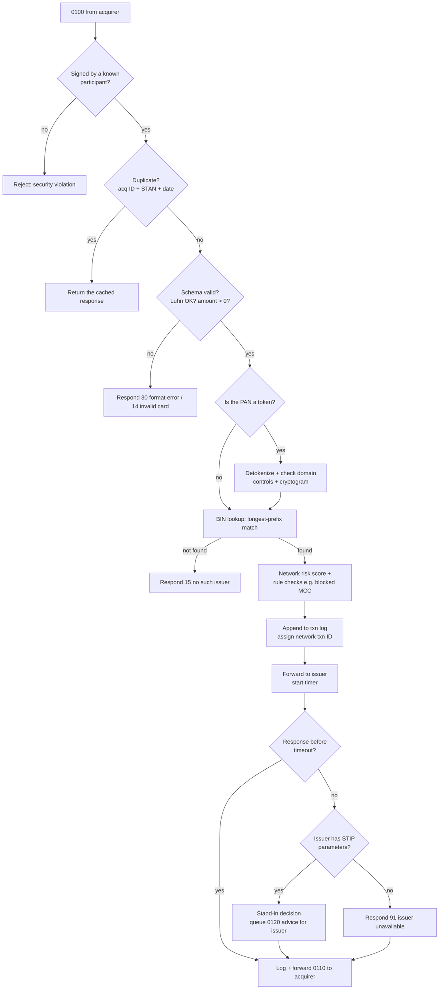
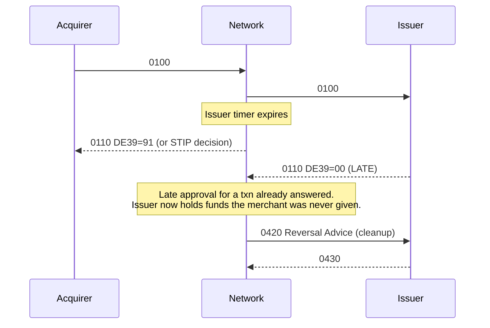

# 04: Authorization Deep Dive

> 🖱️ **Interactive version:** open [`interactive/authorization-request.html`](interactive/authorization-request.html) in a browser. You can click every digit, bit, and field of a real-shaped `0100`/`0110` to see what it means, who sets it, and links to official docs.

Authorization is the real-time core of a network. It is the part that must never go down, and the part whose design decisions are hardest to change later.

## ISO 8583 in five minutes

ISO 8583 is the international standard for card messages. Every network uses its own **variant**: the same structure, but different private fields and rules. A message has three parts:

```
┌──────────┬────────────────────────┬───────────────────────────────────┐
│   MTI    │        Bitmap(s)       │          Data Elements            │
│  "0100"  │ 64 bits: which DEs are │ DE2=PAN, DE3=proc code, DE4=amt…  │
│ 4 digits │ present (2nd bitmap    │ fixed or variable length (LLVAR,  │
│          │ adds DE65–128)         │ LLLVAR)                           │
└──────────┴────────────────────────┴───────────────────────────────────┘
```

### MTI: Message Type Indicator

The 4 digits mean **version · class · function · origin**.

| Digit | Meaning | Common values |
|---|---|---|
| 1st: version | Version of ISO 8583 | `0` = 1987 (still the most common), `1` = 1993, `2` = 2003. ISO 8583:2023 is the current edition; its field definitions are now published by an ISO maintenance agency. |
| 2nd: class | What the message is for | `1` authorization, `2` financial, `4` reversal, `8` network management |
| 3rd: function | Request, response, or advice | `0` request, `1` response, `2` advice, `3` advice response |
| 4th: origin | Who sent it | `0` acquirer, `1` acquirer repeat, `2` issuer |

### The messages you need

| MTI | Name | Direction | Purpose |
|---|---|---|---|
| `0100` | Authorization Request | Acq → Net → Iss | Ask for approval and a hold |
| `0110` | Authorization Response | Iss → Net → Acq | Approve or decline |
| `0120` | Authorization Advice | Net → Iss | "I approved this for you" (stand-in). The issuer must post it. |
| `0130` | Authorization Advice Response | Iss → Net | Acknowledgement |
| `0200` / `0210` | Financial Request / Response | | Single-message (PIN debit, ATM) |
| `0400` / `0410` | Reversal Request / Response | Acq → Iss | Undo or partially undo an auth |
| `0420` / `0430` | Reversal Advice / Response | | A reversal that cannot be declined (e.g., timeout cleanup) |
| `0800` / `0810` | Network Management | Both | Sign-on, sign-off, echo (heartbeat), key exchange, cutover |

### Data elements you will use most

| DE | Name | Format | Example | Notes |
|---|---|---|---|---|
| 2 | Primary Account Number | LLVAR n..19 | `4000001234567899` | Mask in logs |
| 3 | Processing Code | n6 | `000000` | First 2 digits: 00 purchase, 01 cash, 20 refund, 30 balance inquiry |
| 4 | Amount, Transaction | n12 | `000000005420` | **Minor units**, so this is $54.20 |
| 6 | Amount, Cardholder Billing | n12 | | For cross-border transactions after conversion |
| 7 | Transmission Date/Time | MMDDhhmmss | `1009154301` | UTC |
| 11 | STAN | n6 | `004211` | Trace number from the sender |
| 12 / 13 | Local Time / Date | | | Merchant's local time |
| 14 | Expiration Date | YYMM | `2812` | |
| 18 | Merchant Category Code | n4 | `5812` | Restaurant |
| 22 | POS Entry Mode | n3 | `071` | 05 chip, 07 contactless, 01 manual/keyed, 81 e-commerce, 10 credential on file |
| 25 | POS Condition Code | n2 | `00` | Normal, cardholder not present, etc. |
| 32 | Acquiring Institution ID | LLVAR | | Routes the response back |
| 35 | Track 2 Data | LLVAR | | Magnetic stripe equivalent. Never store it. |
| 37 | Retrieval Reference Number | an12 | `628215004211` | Lifecycle matching |
| 38 | Authorization ID Response | an6 | `7Q3K9A` | Set by the issuer on approval |
| 39 | Response Code | an2 | `00` | See the table below |
| 41 | Terminal ID | ans8 | | |
| 42 | Merchant ID | ans15 | | |
| 43 | Merchant Name/Location | ans40 | `JOE'S DINER   AUSTIN TX` | Appears on statements |
| 49 | Currency Code, Transaction | n3 | `840` | ISO 4217 numeric (USD) |
| 52 | PIN Data | b64 | | Encrypted PIN block |
| 54 | Additional Amounts | | | Cashback, available balance, partial-approval amount |
| 55 | ICC / EMV Data | LLLVAR b | | Chip cryptogram (ARQC) and terminal data in TLV |
| 90 | Original Data Elements | n42 | | In a reversal, identifies the original auth |
| 95 | Replacement Amounts | | | Partial reversal amount |
| 48, 60–63, 120–127 | Private / national use | | | Each network's own data: network txn ID, 3DS data, token data |

### `simple-network` JSON model

`internal/iso8583/message.go` already defines `AuthRequest` with DE-numbered JSON names. That keeps every field traceable to ISO, so a binary encoder can be added later without a redesign:

```json
{
  "mti": "0100",
  "de2_pan": "4000001234567899",
  "de3_processing_code": "000000",
  "de4_amount": 5420,
  "de7_transmission_datetime": "1009154301",
  "de11_stan": "004211",
  "de14_expiry": "2812",
  "de18_mcc": "5812",
  "de22_pos_entry_mode": "071",
  "de37_rrn": "628215004211",
  "de41_terminal_id": "TERM0001",
  "de42_merchant_id": "MERCH000000042",
  "de43_merchant_name_location": "JOE'S DINER AUSTIN TX US",
  "de49_currency": "840",
  "cvv2": "123"
}
```

Fields to add as the switch is built: `de32_acquirer_id` (to route the response back), `de38_auth_code` and `de39_response_code` on the `0110`, `de90_original_data` on reversals, and a network-assigned `network_txn_id` (see [12](12-design-decisions.md), D3).

## The authorization pipeline inside the switch



## Response codes (DE39)

The common ISO-style codes. Networks add their own on top.

| Code | Meaning | Who usually sends it | Retry? |
|---|---|---|---|
| `00` | Approved | Issuer | n/a |
| `10` | Partial approval | Issuer | No. Collect the rest another way. |
| `85` | No reason to decline (account verification) | Issuer | n/a |
| `01` | Refer to card issuer | Issuer | No |
| `04` / `07` | Pick up card | Issuer | Never |
| `05` | Do not honor (generic decline) | Issuer | Not as-is |
| `12` | Invalid transaction | Issuer / Network | No |
| `13` | Invalid amount | Issuer / Network | No |
| `14` | Invalid card number | Issuer / Network | No |
| `15` | No such issuer | Network | No |
| `30` | Format error | Network | Fix the message |
| `41` / `43` | Lost / stolen card | Issuer | Never |
| `51` | Insufficient funds / over limit | Issuer | Later, perhaps |
| `54` | Expired card | Issuer | No |
| `55` | Incorrect PIN | Issuer | With the correct PIN |
| `57` / `58` | Transaction not permitted (cardholder / terminal) | Issuer | No |
| `59` | Suspected fraud | Issuer | No |
| `61` | Exceeds amount limit | Issuer | No |
| `62` | Restricted card | Issuer | No |
| `65` | Exceeds frequency limit (or "SCA required" in the EU) | Issuer | With authentication |
| `75` | PIN tries exceeded | Issuer | No |
| `91` | Issuer or switch unavailable | Network | Yes, with backoff |
| `96` | System malfunction | Any | Yes, with backoff |

Networks now regulate **retries**. Merchants that resubmit declined transactions too often are charged excess retry fees, and some codes (such as pick-up, lost, and stolen) must never be retried. **Design lesson:** put a retry category on every response code in your registry.

## Stand-in processing (STIP)

When an issuer is down or slow, the network can decide for it, using **parameters the issuer chose in advance**.

| STIP parameter | Example |
|---|---|
| Maximum amount per transaction | $250 |
| Daily count/amount per card | 5 transactions / $500 |
| Allowed MCCs / blocked MCCs | Block 7995 (gambling) |
| Card-present only? | Yes |
| Check the network negative file (lost/stolen list)? | Always |
| Verify CVV2 / chip cryptogram (with keys the issuer shared)? | Yes, if the network has the keys |

After a stand-in approval, the network sends **`0120` advices** to the issuer when it comes back online, so the issuer can post holds. The issuer is **liable** for stand-in approvals made under its own parameters.

**PLAN.md says "stand-in declines if issuer is down."** That is the safe starting point (respond `91`). Store STIP parameters per issuer anyway, so stand-in approvals can be turned on later without a schema change.

## Timeouts and late responses

These are the hardest edge cases. Decide on them early.



Rules to put in place:
1. **Every hop has a timeout budget**, and the downstream timeout is shorter than the upstream one. For example, acquirer 15s > network 10s > issuer 5s. The exact values are a network rule. Pick them deliberately.
2. **A late response is never forwarded.** The network sends a reversal advice to clean up the issuer's hold.
3. **The acquirer reverses on doubt.** If the acquirer gets no response, it sends a `0400` or `0420` reversal so that no orphan hold stays on the card.
4. **Every message is idempotent**, keyed on (acquirer ID, STAN, transmission date/time). Retries return the cached response instead of creating a second hold.

## Authorization variants the network must support

| Variant | What it is | How it is marked | Example |
|---|---|---|---|
| **Purchase** | Standard auth + capture | Proc code `00` | Retail |
| **Pre-authorization / estimated auth** | Hold an estimated amount. The final amount may differ. | Auth type indicator | Hotel, car rental, gas pump |
| **Incremental auth** | Add to an existing hold | References the original txn ID | Hotel stay extended |
| **Partial approval** | Issuer approves less than requested | DE39 `10`, approved amount in DE54/DE4 | Prepaid card with $30 left on a $50 sale |
| **Account verification** | $0 auth to check the card is valid | Amount 0, response `85` | Saving a card, starting a subscription |
| **Balance inquiry** | Ask for the available balance | Proc code `30` | Prepaid, ATM |
| **Refund authorization** | Online auth of a credit to the card | Proc code `20` | Networks now require it for many refunds |
| **Cash advance / ATM** | Cash withdrawal | Proc code `01`, MCC 6010/6011 | ATM |
| **Recurring / MIT** | Merchant-initiated using a stored credential | Stored-credential indicators + original txn ID | Netflix |
| **Push payment (OCT)** | Credit pushed to a card | Proc code `26` (Original Credit) | Gig-worker payout |
| **Account funding (AFT)** | Pull from a card to fund another account | Specific proc code + flags | Funding a wallet |

## Network management messages (`0800`)

| Function | Why |
|---|---|
| **Sign-on / sign-off** | A participant declares itself ready or not ready for traffic. Route around signed-off issuers (go to STIP). |
| **Echo test** | A heartbeat every N seconds. Missed echoes mark the link as down. |
| **Key exchange** | Rotate working keys (PIN and MAC keys) under a key-encryption key |
| **Cutover** | Marks the end of a business day, which is the clearing cutoff |

## Performance targets (for reference)

- Real networks handle tens of thousands of authorizations per second at peak. Visa publicly cites capacity above 65,000 transaction messages per second.
- Availability targets are about **99.999%**: around 5 minutes of downtime a year. Networks run several active data centers.
- The network's own share of latency is usually tens of milliseconds. Most of the time budget goes to the issuer.

For a local PoC, aim for correctness and observability first. Measure p50, p95, and p99 latency per hop from the start. That habit carries over to a real build.

## Key takeaways

- Use ISO 8583 vocabulary even with JSON. MTIs, DE numbers, and response codes are a shared language that every bank and processor already speaks.
- Timeouts, late responses, duplicates, and reversals are where networks get correctness wrong. Design for them on day one.
- Stand-in processing turns an issuer outage into a business decision made in advance. Build the parameter model early, even if the first version always declines.

Next: [05: Clearing and Settlement](05-clearing-and-settlement.md)
