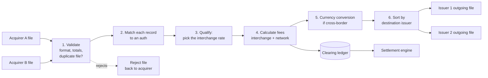
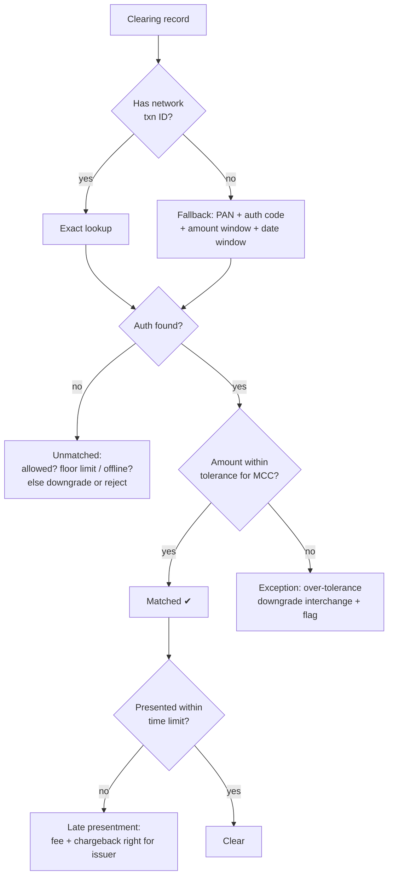
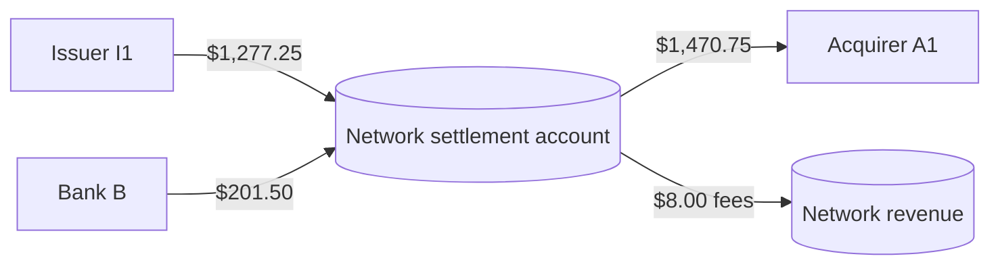
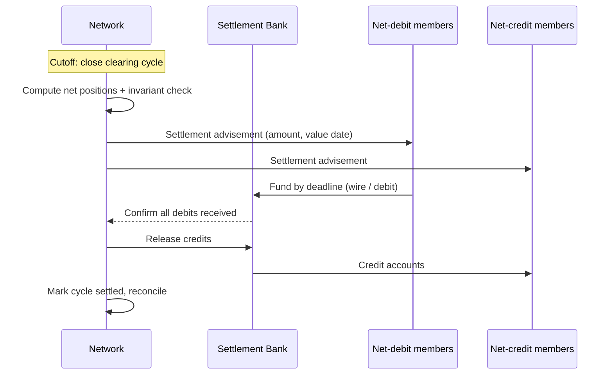

# 05: Clearing and Settlement

Authorization is what people notice. Clearing and settlement are where the money is decided and moved, and where accounting mistakes turn into real losses.

## Clearing: exchanging the final records

### What a clearing record contains

A clearing record (also called a presentment, draft, or "TC05" in Visa's BASE II terms, or a "1240 First Presentment" in Mastercard's IPM format) is the acquirer saying: *"This sale happened, for this final amount, and here is proof it was authorized."*

| Field group | Contents |
|---|---|
| Identity | PAN (or token), network transaction ID, RRN, auth code, acquirer reference number (ARN) |
| Amounts | Final transaction amount + currency, cashback, surcharges |
| Merchant | MID, name/location, MCC, country |
| Dates | Transaction date, auth date, presentment date |
| Qualification data | POS entry mode, e-commerce indicator, 3DS result, chip data, stored-credential flags |
| Enhanced data (optional) | Tax amount, line items (commercial cards, "Level 2/3" data) |

The **ARN (acquirer reference number)** is the lifetime ID of a clearing record. Cardholders and dispute teams use it to find a transaction months later.

### Clearing flow inside the network



### File-level controls

Batch processing fails silently unless you add controls:
- **Header/trailer records** with a record count and a hash total of amounts. Reject the file if they don't match the body.
- **File sequence numbers** per sender. A gap or repeat means a missing or duplicate file.
- **Idempotent ingest**. Processing the same file twice must have no effect. Store the file ID and a hash.
- **Acknowledgement file** back to the sender: accepted counts and totals, plus rejected records with reason codes.

### Matching clearing records to authorizations



Real networks allow tolerances such as: restaurant tips up to about 20% over the auth amount, hotel and car-rental final amounts against an estimate, and fuel pumps against a pre-auth. Put tolerances in a **rule table keyed by MCC**, not in code.

One authorization can map to **several clearing records** (split shipments), and several authorizations can map to one record (incremental auths). Your data model must support 1-to-many and many-to-1.

### Interchange qualification

At clearing, every transaction is assigned an **interchange program**: a rate based on dozens of attributes. Data quality is rewarded and risk is charged extra. See [06](06-economics-and-fees.md).

```
IF card_type = consumer_credit AND tier = rewards
AND mcc IN supermarket
AND entry_mode = chip AND auth_matched AND presented_within 2 days
THEN program = "CPS/Supermarket Rewards" rate = 1.65% + $0.10
ELSE … (fall through to less favorable "standard" program)
```

## Settlement: moving the money

### Gross vs net

Without netting, each bank would pay each other bank for every transaction. Netting combines all of a member's activity into one payment per day, per currency.

### Worked example: one day, three banks

Fee assumptions for the example: interchange 1.80% (acquirer pays issuer), network fee 0.15% on the acquirer and 0.05% on the issuer. **Bank B is both an issuer and an acquirer.**

**Cleared transactions (sales):**

| Merchant's bank (acquirer) → Card's bank (issuer) | Sales |
|---|---|
| Acquirer A1 → Issuer I1 | $1,000.00 |
| Acquirer A1 → Bank B (as issuer) | $500.00 |
| Bank B (as acquirer) → Issuer I1 | $300.00 |
| Bank B (as acquirer) → Bank B (as issuer) | $2,200.00 (an "on-us" transaction routed through the network) |

**Positions per role:**

| Role | Sales | Interchange | Network fee | Net |
|---|---|---|---|---|
| I1 (issuer) | owes $1,300.00 | earns $23.40 | pays $0.65 | **pays $1,277.25** |
| B (issuer) | owes $2,700.00 | earns $48.60 | pays $1.35 | pays $2,652.75 |
| A1 (acquirer) | is owed $1,500.00 | pays $27.00 | pays $2.25 | **receives $1,470.75** |
| B (acquirer) | is owed $2,500.00 | pays $45.00 | pays $3.75 | receives $2,451.25 |

**Net per member (what actually moves):**

| Member | Net settlement |
|---|---|
| I1 | pays **$1,277.25** |
| Bank B | $2,451.25 − $2,652.75 = pays **$201.50** |
| A1 | receives **$1,470.75** |
| Network | receives **$8.00** in fees |
| **Check** | In: 1,277.25 + 201.50 = **1,478.75** · Out: 1,470.75 + 8.00 = **1,478.75** ✔ |



Gross volume was $4,000. Netting reduced the money that actually moved to $1,478.75, in three payments. **Invariant: the sum of all net positions plus network revenue is exactly zero.** If it is not, do not release settlement.

### Settlement mechanics



| Concept | What it means | Design implication |
|---|---|---|
| **Settlement cycle / cutoff** | A fixed time that closes a business day of clearing | Every record belongs to exactly one cycle. Records arriving after cutoff go to the next one. |
| **Value date** | When the money moves (often T+1) | Store separately from the transaction date and the clearing date |
| **Settlement currency** | Each member settles in a set of agreed currencies | Net per (member, currency) |
| **Settlement risk** | A net-debit member fails to pay | Collateral, settlement guarantees, exposure limits, and a default procedure |
| **Settlement bank** | Holds the accounts that move funds | Your engine outputs instructions. It does not hold money itself. |
| **Reconciliation** | Every member checks its report against its own records | Publish detailed reports so members can tie out to the cent |

### Settlement risk and collateral

A network guarantees settlement to the receiving members. If Issuer I1 fails before paying its $1,277.25, the network still owes A1. So networks:
- Monitor each member's **exposure** (unsettled net-debit position) during the day.
- Require **collateral** (letters of credit, cash) from weaker members.
- Can suspend a member's BINs if exposure goes over its limit.

For `simple-network`, track exposure per member as a number and alert on a threshold. That is enough to learn the concept.

## Cross-border and currency

| Term | Meaning |
|---|---|
| Transaction currency (DE49) | What the merchant charged in |
| Billing currency (DE51) | What the cardholder is billed in |
| Settlement currency (DE50) | What the banks settle in |
| Network FX rate | The network publishes daily conversion rates. The rate used is the one in effect at **clearing**, not at auth. |
| Cross-border fee | Extra network fees when issuer and merchant countries differ |
| DCC (dynamic currency conversion) | The merchant offers to charge in the cardholder's currency. The rules require clear disclosure. |

## Accounting model: use double-entry

Treat clearing and settlement as a **ledger**, not as rows of totals.

From the network's point of view (asset = "Due from", liability = "Due to"):

```
Entry: clearing of txn 9f3c… ($64.20, interchange 1.80%, acquirer network fee 0.15%)
  DR  Due from Issuer I1         64.20    issuer owes the sale amount
  CR  Due to Acquirer A1         64.20    acquirer is owed the sale amount
  DR  Due to Acquirer A1          1.16    interchange: acquirer receives less…
  CR  Due from Issuer I1          1.16    …and the issuer pays less
  DR  Due to Acquirer A1          0.10    network fee withheld from the acquirer
  CR  Network fee revenue         0.10
Result: I1 owes 64.20 − 1.16 = 63.04 · A1 is owed 64.20 − 1.16 − 0.10 = 62.94 · network earns 0.10
        Check: 63.04 = 62.94 + 0.10 ✔
```

Rules:
- Money is stored as **integer minor units** plus an ISO 4217 currency code. Never use floats.
- Every entry balances (debits = credits) within a currency.
- Entries are append-only. Corrections are new entries that reverse the mistake.
- Rounding rules are explicit (per transaction, half-up, at a defined step) and published to members.

## Key takeaways

- Clearing turns authorizations into final, priced obligations. Settlement turns those obligations into a few net payments.
- Matching must handle tolerances, splits, and unmatched records. File ingest must be idempotent and controlled by totals.
- Build on a double-entry ledger with integer money, and check that net positions sum to zero before releasing any settlement.

Next: [06: Economics and Fees](06-economics-and-fees.md)
