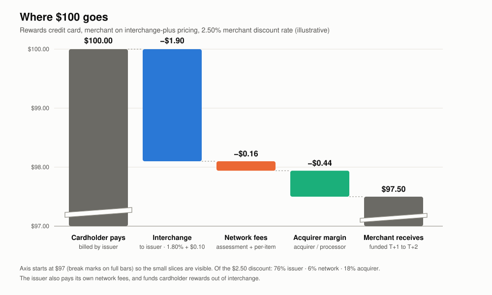
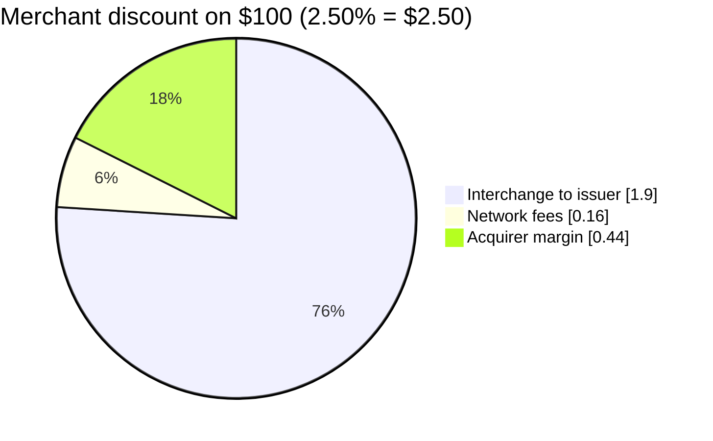
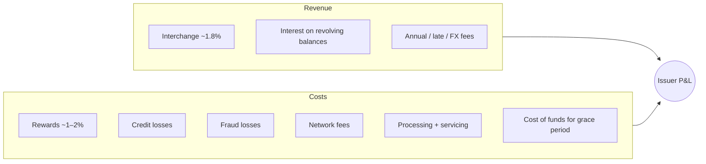

# 06: Economics and Fees

The fee model shapes how every party behaves. Interchange decides which cards issuers push, which rewards cardholders get, and which payment methods merchants prefer. It is also where regulators step in most.

## The $100 purchase waterfall

A merchant on an interchange-plus contract sells $100 to a rewards credit card holder. The total merchant discount rate (MDR) is 2.50%.



| Who | Gets | How |
|---|---|---|
| Cardholder | Pays $100.00 (plus maybe 1.5% back in rewards) | Billed by the issuer |
| **Issuer** | **$1.90** interchange (1.80% + $0.10) | Taken out of the amount at clearing |
| **Network** | **$0.16** (0.14% assessment + about $0.02 processing) | Billed to the acquirer. The issuer pays separate network fees on its side. |
| **Acquirer / processor** | **$0.44** markup | Its own margin on top of pass-through costs |
| **Merchant** | **$97.50** | Funded by the acquirer at T+1 to T+2 |



**The network keeps the smallest slice**, about 6% of the MDR in this example, but from both sides and on enormous volume. Visa's and Mastercard's 2024 net revenues were roughly $36B and $28B.

## Fee types in detail

### Interchange (acquirer → issuer)
- **Set by the network**, paid by the acquirer to the issuer, and passed on to the merchant.
- Pays the issuer for credit risk, fraud losses, the interest-free grace period, and rewards.
- Published in **large rate tables**. The rate depends on:

| Driver | Lower interchange | Higher interchange |
|---|---|---|
| Card product | Regulated debit, prepaid | Premium rewards credit, commercial |
| Channel | Card-present chip / contactless | Card-not-present, keyed |
| Merchant category | Supermarket, utilities, charity, government | Travel, general retail |
| Data quality | Full data, auth matched, captured on time | Missing data, unmatched, late |
| Authentication | 3DS authenticated, tokenized | Not authenticated |
| Merchant size/volume | Large merchants (special rates, "tier 1") | Small merchants |
| Geography | Domestic | Cross-border, inter-regional |

Typical US ranges: regulated debit is about 0.05% + $0.22. Unregulated debit is about 0.8% + $0.15. Consumer credit is about 1.4%–2.5%+. Premium and commercial credit can exceed 2.5%.

### Network fees (to the network, from both sides)

| Fee | Paid by | Basis | Example |
|---|---|---|---|
| Assessment / service fee | Acquirer and issuer | % of volume | ~0.13%–0.15% (acquirer) |
| Authorization / processing fee | Acquirer and issuer | Per message | ~$0.01–$0.02 |
| Clearing fee | Both | Per record | fractions of a cent |
| Cross-border fee | Both | % of cross-border volume | ~0.4%–1%+ |
| Currency conversion | Issuer (passed to cardholder) | % of converted amount | ~0.2%–1% |
| Token / 3DS / risk-score service fees | User of the service | Per call | small per-call fee |
| Misuse fees | Acquirer | Per event | Excess retries, zero-floor violations, late presentment, auth without clearing |
| Compliance fines | The violating member | Per program | Excessive chargebacks, data breaches |

Networks also pay **incentives** back to large issuers and merchants (signing bonuses, volume rebates) to win or keep their volume. These are often very large and tied to multi-year contracts.

### Acquirer pricing to merchants

| Model | How it works | Who uses it |
|---|---|---|
| **Interchange-plus** | Pass-through interchange + network fees, plus a fixed markup | Larger merchants. Clear. |
| **Blended / flat** | One rate for everything (e.g., 2.9% + $0.30) | Stripe, Square, small merchants. Simple. |
| **Tiered** | "Qualified / mid-qualified / non-qualified" buckets | Older and less clear. Often criticized. |
| **Subscription** | Monthly fee + interchange at cost | Some high-volume merchants |

## Issuer economics (why issuers love credit)



**Interchange funds rewards.** That is why regulators who cap interchange (EU, Australia, US debit) have also seen rewards on those cards shrink.

## Regulation of fees (summary)

| Region | Rule | Effect |
|---|---|---|
| US | **Durbin Amendment / Regulation II** (2011) | Debit interchange for issuers with $10B+ in assets capped at 21¢ + 0.05% + 1¢ fraud adjustment. Requires at least two unaffiliated networks on every debit card. The Fed proposed lowering the cap in 2023 (not finalized). In 2025 a federal court vacated the fee standard; the ruling is stayed pending an Eighth Circuit appeal, so the current cap still applies. |
| US | Credit Card Competition Act (proposed, not law) | Would require a second network option on credit cards from large issuers |
| EU | **Interchange Fee Regulation** (2015) | Consumer debit capped at 0.2%, consumer credit at 0.3% |
| UK | EU-style caps kept after Brexit | The networks raised UK–EEA cross-border interchange afterward, which drew regulator (PSR) scrutiny |
| Australia | RBA weighted-average benchmarks; surcharging rules | |
| Many | Network fee scrutiny, honor-all-cards limits, surcharging rules | Merchants may surcharge credit in many US states (capped, with disclosure) |

Network rules also cover **honor all cards** (a merchant that accepts the brand cannot refuse certain cards of that brand), **surcharging** (allowed with limits), and **steering** (merchants may now promote cheaper payment methods in many jurisdictions after antitrust settlements).

## Decisions for `simple-network`'s fee model

PLAN.md's open question is: "Fee model: flat network fee, or interchange tables by MCC and card tier?"

**Recommendation:** build a **table-driven fee engine** from the start, but load it with a tiny table.

```yaml
# fees.yaml (illustrative)
interchange_programs:
  - id: CP_CREDIT_STD
    match: { card_type: credit, entry_mode: [chip, contactless] }
    rate_bps: 150        # 1.50%
    fixed_minor: 10      # $0.10
  - id: CNP_CREDIT_STD
    match: { card_type: credit, entry_mode: [ecommerce, keyed] }
    rate_bps: 180
    fixed_minor: 10
  - id: DEFAULT
    match: {}
    rate_bps: 200
    fixed_minor: 10
network_fees:
  acquirer_assessment_bps: 14
  issuer_assessment_bps: 5
  per_auth_minor: 2
rounding: half_up_per_transaction
```

- Match the **first** program whose conditions are met (ordered rules), and fall back to `DEFAULT`.
- Store the **program ID and rate version** on every cleared transaction, so fees can be reproduced and audited later.
- Use **basis points and integer minor units**. Never use floating-point percentages.
- Date-version the table (`effective_from`), because networks change rates twice a year.

## Key takeaways

- The MDR is split into interchange (largest, to the issuer), network fees (smallest, to the network), and acquirer margin.
- Interchange rewards data quality and lower risk. That makes it the network's main tool for changing how the ecosystem behaves.
- Build fees as versioned rule tables, and record which rule priced each transaction.

Next: [07: Cards, BINs, and Tokens](07-cards-bins-and-tokens.md)
