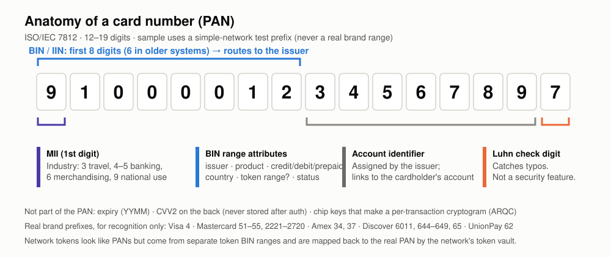
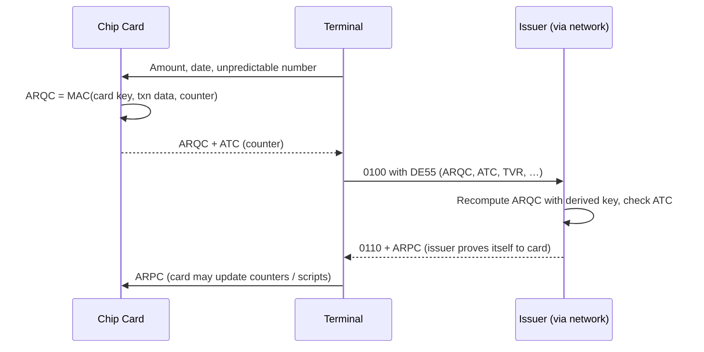
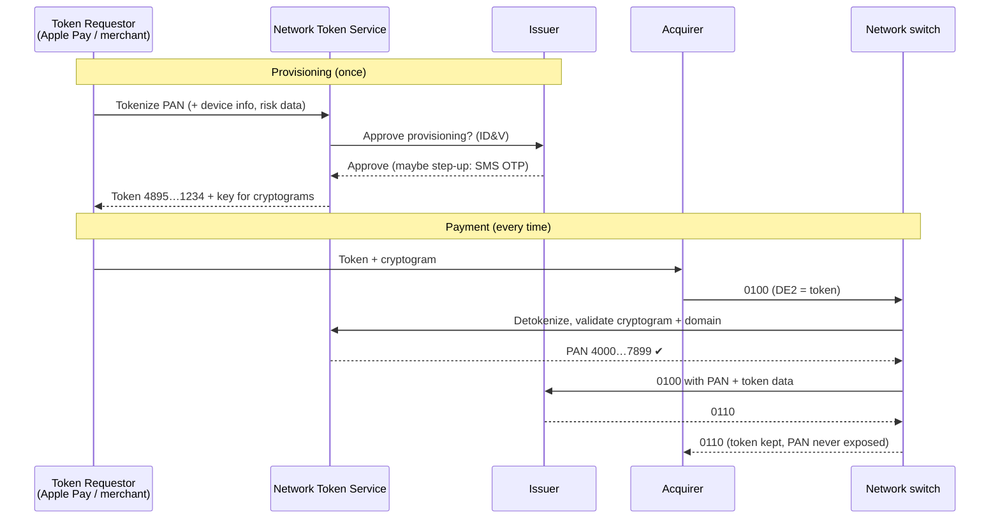
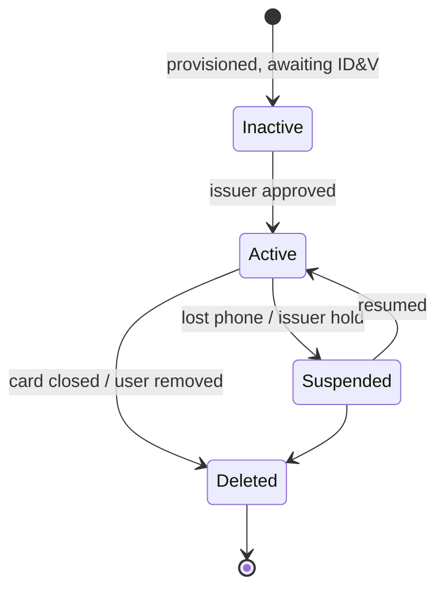

# 07: Cards, BINs, and Tokens

## Anatomy of a card number (PAN)



```
  4  0 0 0 0 0 1 2   3 4 5 6 7 8 9   9
  │  └──────┬─────┘  └──────┬──────┘  │
  │       BIN/IIN        account      Luhn
  │   (4 + 7 = 8 digits) identifier   check
 MII                     (issuer's)   digit
```

| Part | Meaning |
|---|---|
| **MII** (major industry identifier, first digit) | 3 = travel/entertainment (Amex, Diners), 4–5 = banking/financial, 6 = merchandising/banking (Discover, UnionPay) |
| **BIN / IIN** | Identifies the issuer and the card product. The industry moved from **6-digit to 8-digit BINs** (defined in ISO/IEC 7812-1:2017; network migration deadline April 2022) because 6-digit ranges were running out. |
| **Account identifier** | Chosen by the issuer |
| **Check digit** | Luhn (mod 10). Catches single-digit typos and most adjacent swaps. **It is not security.** |
| **Length** | 12–19 digits. 16 is most common, Amex uses 15. |

### Known brand ranges (for recognizing cards)

| Brand | Prefix | Length |
|---|---|---|
| Visa | 4 | 13, 16, 19 |
| Mastercard | 51–55, 2221–2720 | 16 |
| American Express | 34, 37 | 15 |
| Discover | 6011, 644–649, 65 | 16–19 |
| UnionPay | 62 | 16–19 |
| JCB | 3528–3589 | 16–19 |

**`simple-network` should get its own prefix** that does not overlap real brands, to make it clear the cards are fake. For example, use a `9` prefix (MII 9 = national use) such as `9100 xxxx`. Also accept well-known test PANs only in a test mode.

### Luhn algorithm

Implemented in `internal/card/card.go` (`Luhn`, plus `Generate`, which computes the check digit for test cards). The algorithm:

```go
// Starting from the rightmost digit, double every second digit;
// if doubling gives > 9, subtract 9. The PAN is valid when the sum % 10 == 0.
func luhnSum(digits string) int {
	sum, double := 0, false
	for i := len(digits) - 1; i >= 0; i-- {
		d := int(digits[i] - '0')
		if double {
			if d *= 2; d > 9 {
				d -= 9
			}
		}
		sum += d
		double = !double
	}
	return sum
}
```

Worked example: `4000 0012 3456 7899` is valid. `9100 0012 3456 789?` needs check digit `7`.

## The BIN table: the routing core

The BIN table maps PAN ranges to issuers and card attributes. Each entry is a **range**, not just a prefix:

| Field | Example | Used for |
|---|---|---|
| `range_low` / `range_high` | `91000000` / `91009999` (compared on the first 8 digits, or on the full padded PAN) | Matching |
| `issuer_id` | `ISS_A` | Routing |
| `product` | `consumer_credit_rewards` | Interchange, rules |
| `funding_source` | credit / debit / prepaid | Interchange, regulation (Durbin), refunds |
| `country`, `currency` | `US`, `840` | Cross-border detection |
| `pan_length` | 16 | Validation |
| `token_range` | false | Detokenize first if true |
| `status` | active / suspended | Issuer offboarding |
| `effective_from` | date | Safe, planned changes |

**Lookup rule:** use **longest-prefix (or narrowest-range) match**, so a sub-range like `91000012` can override its parent `910000`. Load the table into memory with an index (a sorted array with binary search, or a trie). The table changes rarely and is read millions of times.

Networks **publish BIN tables to acquirers** (BIN files and BIN attribute services) so that merchants can tell debit from credit, detect prepaid cards, and route correctly.

## Card security values

| Value | Where it lives | What it proves | Verified by |
|---|---|---|---|
| **CVV / CVC** (CVV1) | Magnetic stripe track data | The stripe was read from a real card | Issuer (keys) |
| **CVV2 / CVC2** | Printed on the card | The person has the physical card (CNP) | Issuer |
| **iCVV** | Chip's track-2 equivalent | Stops stripe data copied from a chip from being reused | Issuer |
| **ARQC** (chip cryptogram) | Generated by the chip per transaction | The chip is genuine **and** this transaction is unique (no replay) | Issuer (or the network in STIP) |
| **Dynamic CVV** | Changes on some cards with a display | Stops reuse of stolen CVV2 | Issuer |
| **Token cryptogram** (e.g., TAVV, UCAF/DSRP) | Generated by the device wallet (keys from the TSP), or by the network TSP on request for e-commerce/card-on-file tokens | The token is used by its authorized device/domain | Network TSP |

All of these are verified with keys the issuer (or network) holds in **HSMs**; chip and device cryptograms are generated with per-card keys derived from those master keys. CVV2 **must never be stored** after authorization (a PCI DSS requirement).

## EMV chip: why counterfeit fraud collapsed



A copied chip cannot make a valid ARQC for a new transaction, because the card key never leaves the chip. That is why fraud moved to card-not-present channels, where tokenization and 3DS are the fix.

## Network tokenization

A **network token** is a substitute PAN that the network issues to a specific **token requestor** (a wallet, merchant, or gateway). It only works within limits: that requestor, that device, that channel.



| Benefit | Why |
|---|---|
| Breach resistance | A stolen token is useless outside its domain (device/merchant) |
| **Lifecycle management** | When a card is reissued (new expiry or PAN), the network updates the token-to-PAN mapping. The merchant's stored token keeps working. |
| Higher approval rates | Issuers trust tokens with cryptograms more |
| Lower fraud and sometimes lower interchange | Better authentication data |

**Tokens vs PSP tokens:** a gateway's token (like `tok_abc` at Stripe) only exists inside that gateway, and the gateway still sends the real PAN to the network. A **network token** replaces the PAN in the network message itself.

**Token BIN ranges** are separate from card BIN ranges. Your BIN table should mark them (`token_range = true`) so the switch knows to detokenize before routing.

### Token states



## Should `simple-network` build a tokenization service?

**Yes, and part of it already exists.** It teaches the network's most important modern service and pushes you to keep PAN handling inside one boundary. Milestone 3 shipped a small in-switch version:
- An in-memory token vault inside the network (`internal/network/vault.go`): token ↔ PAN, expiry, wallet, status.
- Token BIN ranges in the BIN table (`token_range = true`).
- A detokenize step in the switch pipeline (see [04](04-authorization-deep-dive.md)).

What is still planned, as M10 after hardening (M9), and kept small:
- A separate token service with its own database, so the vault moves out of the switch.
- A simple HMAC-based cryptogram per transaction to show domain restriction.

## Key takeaways

- The BIN is the routing key. Model BIN ranges with attributes, versions, and longest-prefix matching.
- Luhn catches typos. Cryptograms (chip and token) are the real security.
- Network tokens let card-on-file payments survive card reissues and data breaches. They are now among a network's most valuable services.

Next: [08: Exceptions and Disputes](08-exceptions-and-disputes.md)
