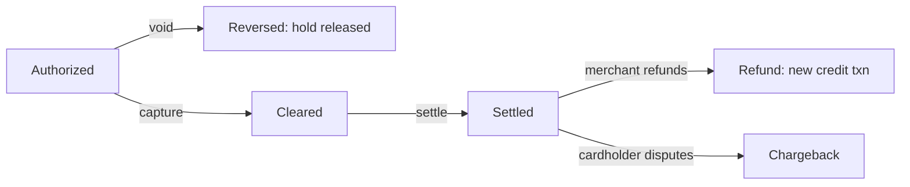
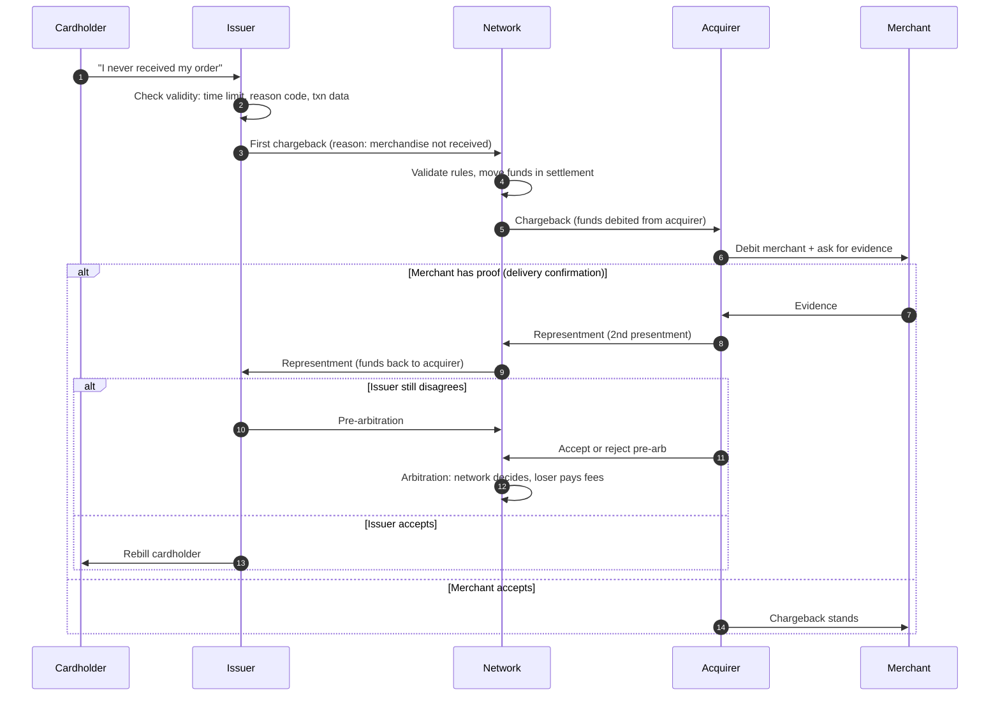
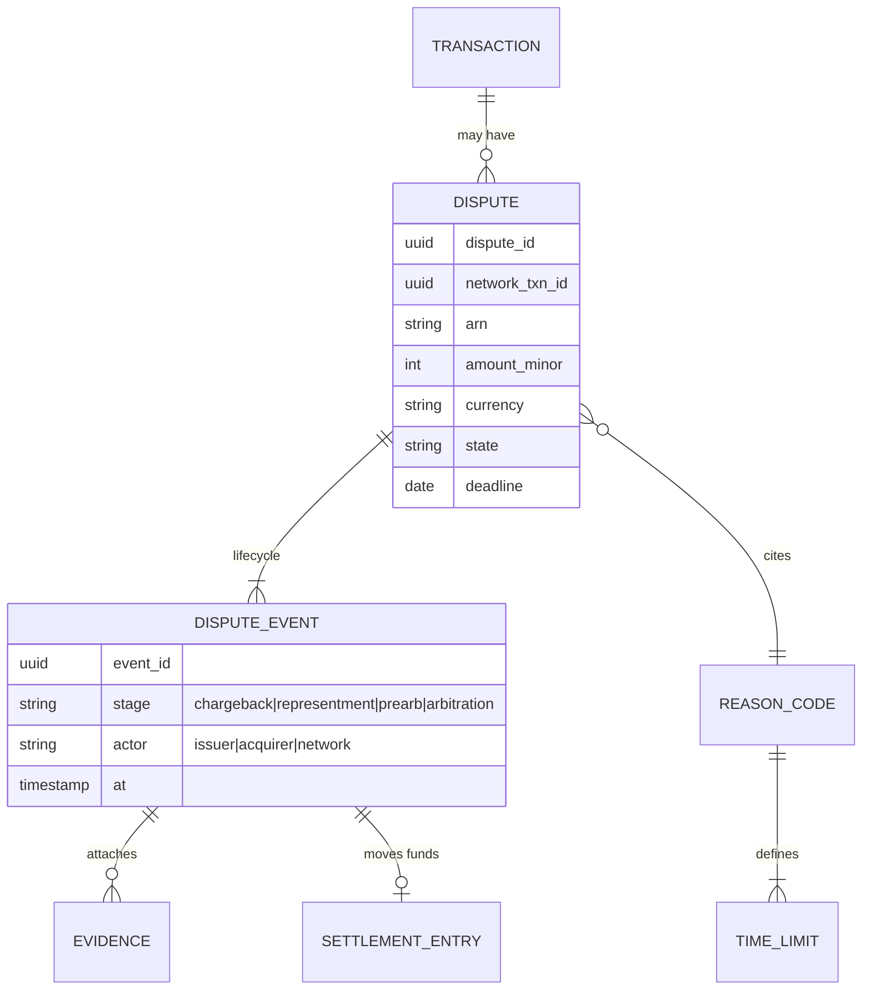

# 08: Exceptions and Disputes

The normal purchase is the easy part. A network earns trust in how it handles everything that goes wrong: voids, refunds, duplicate charges, fraud, and goods that never arrived.

## The four ways to undo money

| Mechanism | Who starts it | When | Message / record | Effect |
|---|---|---|---|---|
| **Reversal (void)** | Acquirer/merchant | Before clearing (usually the same day) | `0400` / `0420` | Releases the issuer's hold. No money moved, so there is nothing to refund. |
| **Partial reversal** | Acquirer/merchant | Before clearing | `0400` with replacement amount (DE95) | Lowers the hold (e.g., the hotel estimate was too high) |
| **Refund (credit)** | Merchant | After clearing | Credit presentment (+ refund auth, now often required) | New transaction moving money back to the cardholder |
| **Chargeback** | **Issuer** (on behalf of the cardholder) | After settlement, within time limits | Chargeback record through clearing | Forced reversal of funds from acquirer to issuer, under the dispute rules |

**Prefer reversals to refunds.** A reversal before clearing costs almost nothing and the cardholder sees it fast. A refund is a second full transaction with its own fees and delay. Networks charge fees when merchants hold auths they never clear instead of reversing them.

## Reversal mechanics

A reversal must identify the original authorization **exactly**:
- DE90 (Original Data Elements): original MTI, STAN, transmission date/time, and acquirer ID.
- Or the network transaction ID from the original response.

Edge cases your switch must handle:
| Case | Correct behavior |
|---|---|
| Reversal for an auth the network never saw | Respond "original not found" (the reversal is still logged) |
| Reversal arrives **before** the auth response (race) | Hold or link it. The issuer must never end up with a hold after it gets the reversal. |
| Duplicate reversal | Idempotent: return the same response |
| Reversal after clearing | Reject. The merchant must refund instead. |
| Partial reversal larger than the remaining hold | Reject, or cap at the remaining hold (choose and document it) |

## Chargebacks: the dispute lifecycle

A chargeback is the **cardholder's protection** and the main reason people trust paying with cards. The issuer claims money back from the acquirer, citing a **reason code**. The acquirer can accept it or fight it with evidence.

### Dispute stages and typical time limits

| Stage | Who acts | Typical time limit |
|---|---|---|
| Retrieval request / request for information | Issuer asks for transaction documents | (optional, often skipped now) |
| **First chargeback** | Issuer | Usually **120 days** from processing (or from the expected delivery date) |
| **Representment** | Acquirer | Around 30 days from the chargeback |
| **Pre-arbitration** | Issuer | Around 30 days |
| **Arbitration** | Network decides | Fees can be several hundred dollars, paid by the loser |

### Reason code categories

Both big networks group reasons in a similar way. Visa (Visa Claims Resolution) uses four groups:

| Category | Visa code group | Examples | Mastercard equivalent |
|---|---|---|---|
| **Fraud** | 10.x | 10.4 Card-absent fraud; 10.1 EMV liability shift counterfeit | 4837 No cardholder authorization |
| **Authorization** | 11.x | 11.3 No authorization; 11.1 Card recovery bulletin | 4808 Authorization-related |
| **Processing errors** | 12.x | 12.6 Duplicate processing; 12.5 Incorrect amount; 12.7 Invalid data | 4834 Point-of-interaction error |
| **Consumer disputes** | 13.x | 13.1 Not received; 13.3 Not as described; 13.2 Cancelled recurring | 4853 Cardholder dispute |

Each reason code has its own **conditions** (what the issuer must show), **time limit**, and **valid responses** (what evidence the acquirer can use). That is a rule table, and it belongs in data.

### Fraud disputes and liability shift

Who loses on a fraud chargeback depends on authentication:

| Situation | Liability usually falls on |
|---|---|
| Chip card, merchant only swiped (no chip terminal) | Merchant/acquirer (EMV liability shift) |
| Chip card, chip used, still counterfeit | Issuer |
| E-commerce, **3DS authenticated** | Issuer |
| E-commerce, no 3DS | Merchant |
| Approved in stand-in under issuer parameters | Issuer |
| Network token with valid cryptogram | Generally better protected for the merchant (depends on the program) |

### Compliance monitoring

Networks track each merchant's **dispute ratio** (chargebacks ÷ transactions) and **fraud ratio**. Merchants above thresholds go into monitoring programs. Visa's VAMP combines fraud reports and disputes into one ratio over CNP sales (Excessive merchant ≥1.5% and ≥1,500 events/month in most regions since April 2026). Mastercard's ECM starts at 1.5% and 100 chargebacks. Merchants in these programs pay fines that grow over time, and the acquirer can lose the merchant if it does not improve. This protects the whole system from bad merchants.

### Pre-dispute services

Modern networks offer ways to settle a dispute **before** it becomes a chargeback:
- **Order insight / enriched data:** the issuer sees merchant receipt details while the cardholder is on the phone, which stops "I don't recognize this charge" disputes.
- **Dispute alerts / collaboration:** the merchant gets a chance to refund before a chargeback is filed.
- **Compelling evidence rules:** past undisputed transactions from the same device or account can disprove "friendly fraud" (first-party misuse).

## Dispute data model for `simple-network`

Rules:
- Every stage that moves money creates a **settlement entry** in the next settlement cycle. Disputes are just more ledger entries.
- **Deadlines are enforced by the network**. A late chargeback or late representment is rejected automatically.
- Partial chargebacks are allowed (e.g., one item out of three).

## Key takeaways

- Reversal before clearing, refund after clearing, chargeback when the merchant won't or can't refund.
- Disputes are a time-limited state machine with rule tables behind it (reason code → conditions → time limits → allowed responses).
- Liability depends on authentication (chip, 3DS, tokens). This is how the network pushes the ecosystem toward safer technology.

Next: [09: Risk, Fraud, and Security](09-risk-fraud-and-security.md)
