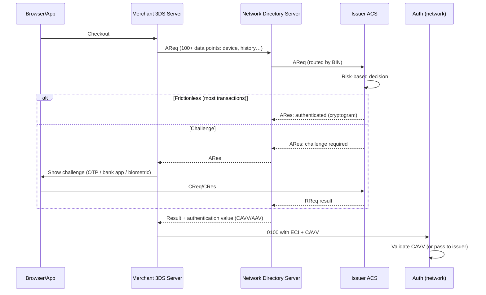
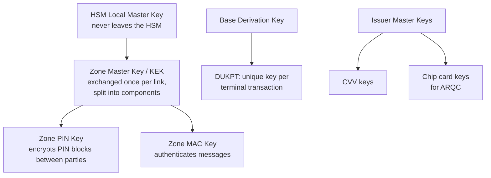

# 09: Risk, Fraud, and Security

A network is a target: it handles card data for billions of accounts, and one weakness can be attacked across the whole system. Security is split across layers. The network enforces it in its own systems and requires it from members.

## The threat map

| Threat | Example | Main defenses |
|---|---|---|
| Counterfeit card | Skimmed magnetic stripe cloned onto a blank card | EMV chip cryptograms, iCVV, stripe fallback rules |
| Card-not-present fraud | Stolen card numbers used online | 3DS, CVV2, AVS, tokens, fraud scoring |
| Account takeover | Criminal changes the address and orders a new card | Issuer controls, device intelligence |
| Card testing / enumeration | Bots try thousands of PAN/expiry/CVV2 combinations with small auths | Velocity rules at the network, BIN attack detection, CAPTCHA at merchants |
| Merchant fraud / transaction laundering | Fake merchant processes stolen cards, or hides illegal goods under a harmless MCC | Acquirer underwriting, network merchant monitoring |
| Data breach | Malware at a retailer steals card data | PCI DSS, tokenization, point-to-point encryption |
| Insider / key compromise | Stolen PIN keys | HSMs, split knowledge, dual control |
| First-party ("friendly") fraud | Cardholder disputes a real purchase | Compelling-evidence rules, enriched data |
| Network message tampering / spoofing | Fake approval injected into a link | Message authentication (MAC), mTLS, private networks |

## Layered fraud defense

```mermaid
flowchart LR
    subgraph Merchant
        M1[Device fingerprint<br/>velocity, CAPTCHA]
        M2[3DS request]
    end
    subgraph Acquirer
        A1[Merchant monitoring<br/>underwriting]
    end
    subgraph Network
        N1[Real-time risk score<br/>on every auth]
        N2[BIN attack detection]
        N3[3DS Directory Server]
        N4[Token domain controls]
        N5[Negative files<br/>lost/stolen]
    end
    subgraph Issuer
        I1[Authorization rules<br/>+ ML model]
        I2[Cryptogram / CVV / PIN checks]
        I3[Cardholder alerts]
    end
    Merchant --> Acquirer --> Network --> Issuer
```

The network sees **activity across all issuers and merchants**, which no single bank can. That makes network-level scoring very valuable. It can spot a merchant being used for card testing across 500 issuers at once. Visa Advanced Authorization and Mastercard Decision Intelligence are network risk scores sent to issuers in the authorization message.

### A simple network risk score for `simple-network`

Start with explainable rules, and add ML later:

| Signal | Example rule | Score |
|---|---|---|
| Velocity per PAN | > 5 auths in 10 min | +30 |
| Velocity per merchant | > 50 declines/min on different PANs | +50, flag "card testing" |
| Amount anomaly | > 10× the cardholder's typical amount | +20 |
| Geography | Card-present in two countries within 1 hour | +40 |
| MCC risk | High-risk MCCs (e.g., 7995, 5967) | +10 |
| Entry mode | Keyed PAN at a terminal that supports chip | +15 |

Send the score in a private field to the issuer. **The issuer still decides.** The network only declines on its own for hard rules (e.g., a blocked merchant).

## 3-D Secure (EMV 3DS 2.x)

3DS lets the **issuer authenticate the cardholder** during an online checkout, and moves fraud liability to the issuer.

| Term | Meaning |
|---|---|
| **Directory Server (DS)** | Run by the network. Routes authentication messages by BIN, like the switch does for authorizations. |
| **ACS** | The issuer's (or its vendor's) authentication server |
| **CAVV / AAV** | A cryptographic proof that authentication happened, checked during authorization |
| **ECI** (e-commerce indicator) | Visa: 05 fully authenticated, 06 attempted, 07 not authenticated. Mastercard: 02 / 01 / 00. |
| **SCA** | The EU PSD2 *Strong Customer Authentication* requirement (two of: knowledge, possession, inherence). 3DS is how cards comply. |
| Exemptions | Low value, low risk (TRA), trusted beneficiary, merchant-initiated. These are marked in the message. |

## Cryptography and keys

Networks protect PINs and messages with symmetric keys kept in **Hardware Security Modules (HSMs)**.

| Practice | Meaning |
|---|---|
| **PIN translation** | The PIN block is decrypted and re-encrypted from one zone key to the next **inside an HSM** at each hop. The clear PIN never exists in software. |
| **Split knowledge / dual control** | Master keys are entered as several components by different custodians |
| **Key rotation** | Working keys are changed regularly (often through `0800` key-exchange messages) |
| **Message authentication** | A MAC over the important fields detects tampering |

**For `simple-network`:** PLAN.md's "HMAC first, mTLS later" is right. Concretely:
1. Each participant has an HMAC key in the registry. Sign the canonical JSON body plus a timestamp plus a nonce. Reject skewed timestamps and reused nonces (replay protection).
2. Add mTLS with a small local CA. Each participant gets a client certificate. The switch maps the certificate subject to the participant ID.
3. Keep keys in a separate secrets file (already in `.gitignore` via `.env`) and design for rotation (key IDs in a header).
4. Skip PINs entirely, or simulate PIN translation to learn the idea. Never build "real" PIN handling outside an HSM.

## PCI DSS (Payment Card Industry Data Security Standard)

Run by the PCI Security Standards Council (founded by the card brands). The current version is **v4.0.1**. It applies to everyone who stores, processes, or transmits card data.

| Principle | Highlights |
|---|---|
| Build and maintain a secure network | Firewalls/segmentation, no vendor-default passwords |
| Protect account data | **Never store** full track data, CVV2, or PIN after authorization. Store PAN encrypted or tokenized. Show at most the BIN (first 6, or 8 for 8-digit BINs) and last 4 digits. |
| Vulnerability management | Patching, anti-malware, secure development |
| Strong access control | Need-to-know, unique IDs, MFA |
| Monitor and test | Logging, file-integrity monitoring, pen tests, scans |
| Information security policy | Risk assessments, incident response |

**Scope reduction is the main strategy.** Every system that touches a PAN is "in scope." Tokenization and segmentation shrink the scope. In `simple-network`, keep the PAN inside the switch's routing path, the issuer, and the token vault. Log only masked PANs (`400000******7899`) or a keyed hash for correlation.

Related standards: **PCI PIN** (PIN handling), **PCI PTS** (terminal hardware), **PCI 3DS**, **PCI P2PE**, **PCI SSF** (software).

## Operational resilience

| Practice | Why |
|---|---|
| Active-active data centers | No single site can take down payments |
| Stand-in processing | An issuer outage does not stop all of its cards ([04](04-authorization-deep-dive.md)) |
| Graceful degradation | Optional services (risk score, token data) fail open or closed by **explicit policy** |
| Change freezes during peak (e.g., Black Friday) | Most outages come from changes |
| Replayable event log | Rebuild state after a failure |
| Per-participant rate limits / circuit breakers | One bad acquirer cannot overload the switch |

## Key takeaways

- The network adds risk value because it sees across the whole ecosystem. Score every authorization, but let issuers decide.
- 3DS and chip move liability to whoever has the stronger authentication. That is how the rules push security adoption.
- Keep PAN handling inside as few components as possible, mask everything else, and authenticate every message between participants.

Next: [10: Rules, Governance, and Regulation](10-rules-governance-and-regulation.md)
