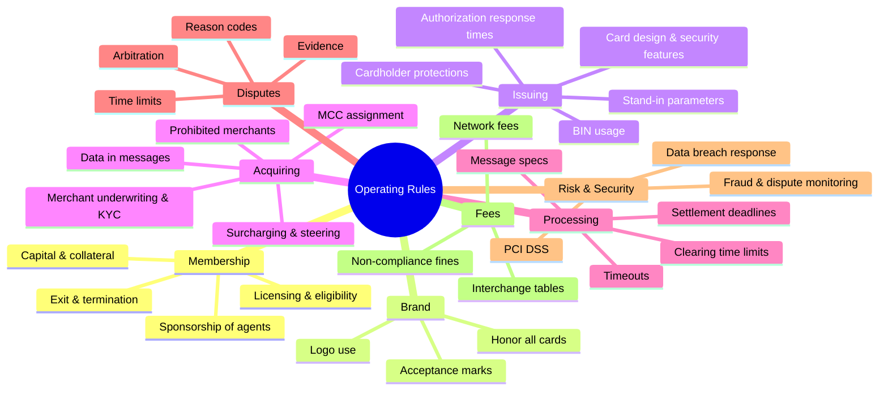
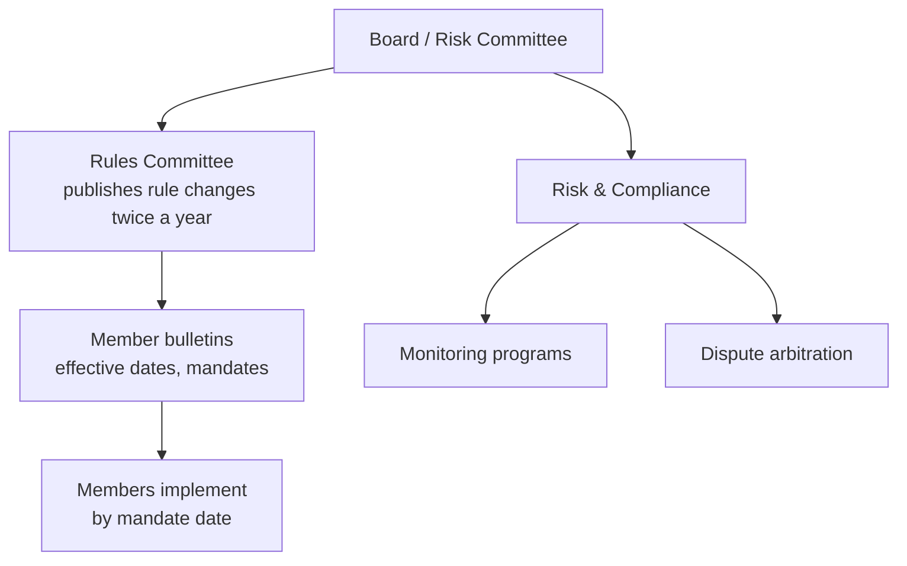

# 10: Rules, Governance, and Regulation

Software moves the messages. **Rules** make thousands of independent banks trust each other enough to move real money based on those messages. Visa's and Mastercard's public rulebooks run to well over a thousand pages. The rulebook is a core part of the product.

## What the rulebook covers

## Why rules matter more than code

| Problem between strangers | How the rules solve it |
|---|---|
| "Will I be paid if I accept this card?" | **Guaranteed settlement**: the network guarantees payment for properly authorized and cleared transactions. |
| "What if the merchant is a fraud?" | Acquirer liability plus chargeback rights |
| "What if the issuer approves fraud?" | Liability rules based on authentication (chip, 3DS) |
| "Who decides disputes?" | Network arbitration, whose decision is final between members |
| "How do I know the other bank is secure?" | Mandatory PCI DSS and network audits |
| "What if a bank fails mid-cycle?" | Collateral requirements and settlement guarantees |

## Membership and licensing

- **Principal members** sign the membership agreement, settle directly, and take full liability. Usually regulated banks.
- **Associate / affiliate members** go through a principal.
- **Agents** (processors, ISOs, PayFacs, program managers) must be **registered** by a member, who is responsible for them.
- Requirements: regulatory status, capital, risk controls, technical certification, settlement arrangements, and collateral if needed.

**For `simple-network`:** model members with `type`, `status` (pending, active, suspended, terminated), `sponsor_id`, `settlement_account`, `collateral_minor`, and `exposure_limit_minor`. Suspending a member must stop its traffic in real time.

## Certification

Before a participant goes live, it must pass a **certification**: a test suite run against the network's test environment.

| Area | Example test cases |
|---|---|
| Messaging | Every MTI/proc code the member will use. Malformed messages are handled. |
| Response handling | Every response code. Timeouts. Late responses. |
| Reversals | Full, partial, duplicate, and orphan reversals |
| Clearing | File format, totals, rejects, re-submission |
| Security | Key exchange, MAC verification, PIN translation |
| Products | Tokens, 3DS data, stored credentials, partial auth |

**Design lesson:** build a **certification harness** early. It is a test suite any simulated participant must pass. It doubles as your integration test suite.

## Compliance programs

| Program | Watches | Consequence |
|---|---|---|
| Dispute monitoring | Merchant chargeback ratio | Escalating monthly fines, then merchant termination |
| Fraud monitoring | Merchant fraud-to-sales ratio | Fines, liability shift to the acquirer |
| Excessive retries | Declined auths resubmitted | Per-transaction fees |
| Data security | PCI compliance, breaches | Fines, forensic investigation, account data compromise recovery costs |
| Brand protection | Illegal or brand-damaging merchants | Fines, termination |
| Data quality | Missing or wrong fields (MCC, merchant name) | Interchange downgrades, fines |

## Regulation of networks

| Area | Examples | Effect on design |
|---|---|---|
| **Interchange caps** | US Durbin (debit), EU IFR, Australia | Rate tables must carry flags for regulated vs unregulated issuers |
| **Routing choice** | Durbin requires two unaffiliated networks on US debit cards (now including card-not-present) | Debit cards carry multiple networks. Merchants choose the route. |
| **Antitrust** | Merchant interchange lawsuits, DOJ actions on debit | Limits on anti-steering and honor-all-cards rules |
| **Systemic importance** | Networks overseen as critical payment infrastructure in several regions | Resilience requirements, incident reporting |
| **Data protection** | GDPR, CCPA, data localization (India, Russia, others) | Where data is stored and processed |
| **Domestic processing laws** | Some countries require domestic transactions to be switched locally | Regional switches |
| **Sanctions / AML** | OFAC and similar | Members and merchants screened; country blocks |
| **Consumer protection** | US Reg Z (credit) and Reg E (debit) dispute rights; zero-liability policies | Minimum dispute rights the rules must meet |

## Governance structure

Networks change rules on a fixed schedule (often **April and October** releases), with notice periods. **Mandates** (e.g., "all acquirers must support 8-digit BINs by April 2022") are how the network moves the whole ecosystem at once.

## Rules as code in `simple-network`

Most of the rulebook can be stored as **versioned data**:

| Rule type | Store as |
|---|---|
| Interchange and fees | `fees.yaml` with `effective_from` ([06](06-economics-and-fees.md)) |
| Clearing tolerances by MCC | Table |
| Auth expiry periods by MCC | Table |
| Dispute reason codes, time limits, valid responses | Table |
| STIP parameters | Per-issuer config |
| Blocked MCCs / countries / merchants | Table |
| Response code retry policy | Table |

Every decision should log **which rule version** it used. "Why was this fee $1.16?" must have an answer months later.

## Key takeaways

- The rulebook is how strangers trust each other: guaranteed settlement, liability rules, and dispute rights.
- Networks are regulated (fees, routing, antitrust, resilience). Design rate and routing tables to support regulatory flags.
- Store rules as versioned data, certify participants against them, and log the rule version behind every decision.

Next: [11: Network Products and Services](11-network-products-and-services.md)
