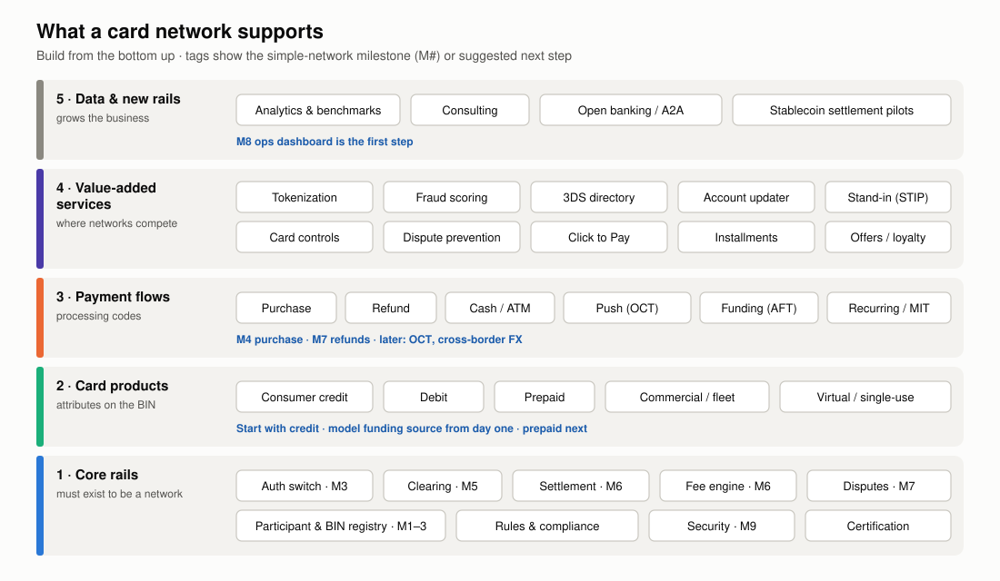
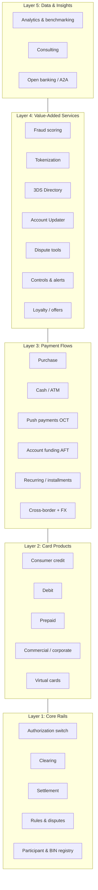
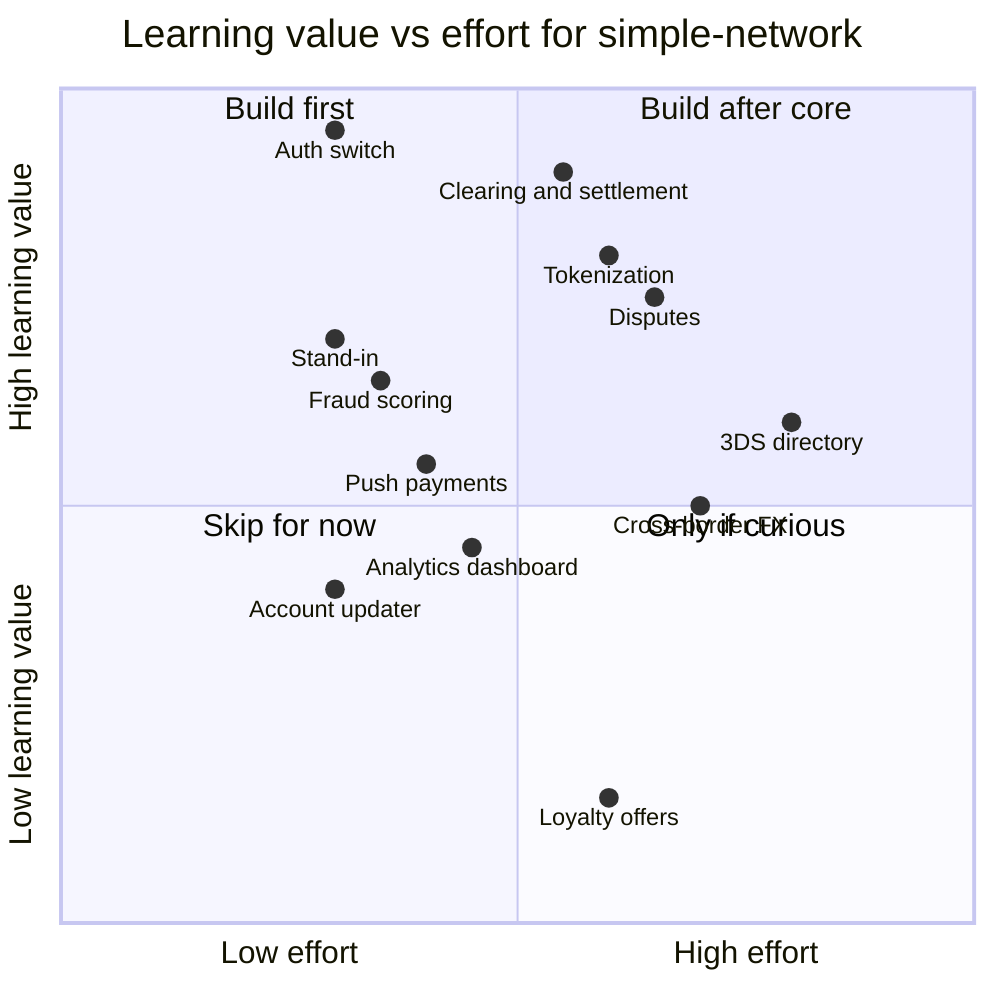

# 11: Network Products and Services

The answer to "what does a network support?" Modern networks are much more than switches. Visa and Mastercard sell dozens of **value-added services**, and these are now a fast-growing share of their revenue.

## Capability layers

## Layer 1: Core rails (needed to exist)

| Capability | Real-world example | `simple-network` milestone |
|---|---|---|
| Authorization switch | VisaNet, Mastercard Banknet | M3 |
| Clearing | Visa BASE II, Mastercard GCMS | M5 |
| Settlement | Visa Settlement Service (VSS), Mastercard Settlement (via settlement banks) | M6 |
| Disputes | Visa Resolve Online, Mastercom | M7 |
| Participant & BIN registry | Member onboarding, BIN licensing | M1–M3 |

## Layer 2: Card products the network must support

Each product changes rules, interchange, and message behavior:

| Product | What differs |
|---|---|
| **Consumer credit** | Revolving credit line, rewards tiers (classic → signature → infinite / world elite), higher interchange |
| **Debit** | Draws from a bank account. Often regulated interchange. May be single-message (PIN) or dual-message (signature). Must support routing to a second network (US). |
| **Prepaid** | Stored value. Partial approvals and balance inquiries are common. Reloadable vs gift. |
| **Commercial** (corporate, purchasing, fleet) | Level 2/3 data (tax, line items), spend controls by MCC, higher interchange |
| **Virtual cards** | Single-use or merchant-locked numbers for B2B payments and online shopping |
| **Charge cards** | Must be paid in full each month |

`simple-network`'s open question "credit only, or debit/prepaid too?" → **Recommendation:** start credit-only, but put `funding_source` in the BIN table from day one. Add prepaid next: it is the cheapest way to exercise partial approvals and balance inquiries.

## Layer 3: Payment flows beyond "buy something"

| Flow | Description | Example |
|---|---|---|
| **Purchase** | Standard pull payment | Groceries |
| **Purchase with cashback** | Cash at the register | Debit at a supermarket |
| **Cash advance / ATM** | Cash from credit or debit | ATM withdrawal |
| **Refund** | Credit back to the card | Return |
| **Original Credit Transaction (OCT)** / push payments | **Push** money **to** a card in near real time | Visa Direct, Mastercard Move: gig payouts, insurance claims, P2P |
| **Account Funding Transaction (AFT)** | Pull from a card to fund another account | Loading a wallet, P2P sender side |
| **Recurring / installments** | Stored-credential merchant-initiated payments | Subscriptions, buy-now-pay-later on card rails |
| **Cross-border + currency conversion** | Network FX, multi-currency settlement | Travel |
| **Contactless transit** | Tap to ride, aggregated fares | Subway open-loop fares |
| **Bill pay / B2B** | Virtual cards and straight-through processing for businesses | Accounts payable |

## Layer 4: Value-added services

| Service | Problem it solves | Who pays | Real-world example |
|---|---|---|---|
| **Network tokenization** | PANs stolen in breaches. Card-on-file breaks when a card is reissued. | Token requestors / issuers | Visa Token Service, Mastercard Digital Enablement Service |
| **Account Updater** | Stored cards expire and recurring payments fail | Acquirers / merchants | Visa Account Updater, Mastercard Automatic Billing Updater |
| **Real-time fraud scoring** | Issuers see only their own traffic | Issuers | Visa Advanced Authorization, Mastercard Decision Intelligence |
| **3DS Directory Server** | Online authentication across all issuers | Per authentication | Visa Secure, Mastercard Identity Check |
| **Card controls & alerts** | Cardholders want to lock cards and limit categories | Issuers | Spend controls, transaction alerts |
| **Stand-in processing** | Issuer outages | Issuers | STIP |
| **Dispute prevention** | Expensive chargebacks | Merchants / issuers | Order insight, dispute alerts |
| **Click to Pay / secure remote commerce** | Typing card details at checkout | | EMVCo SRC |
| **Installments** | Buy-now-pay-later competition | Issuers / merchants | Network installment APIs |
| **Loyalty / card-linked offers** | Driving spend | Merchants | Merchant offers platforms |
| **Account verification / name check** | Confirm an account is valid before payout | Requestor | $0 auth, account name inquiry |

## Layer 5: Data, insights, and new rails

- **Analytics and benchmarking** sold to issuers, merchants, and governments (spending trends, fraud benchmarks).
- **Consulting** (both networks run large advisory businesses).
- **Open banking / account-to-account payments**: networks have bought open-banking companies to stay relevant as non-card payments grow.
- **Stablecoin / blockchain settlement pilots**: some networks now settle with selected partners in stablecoins.

## Which services to build, in order

Stand-in approvals land in hardening (PLAN M9). Suggested order after that: **tokenization (M10) → simple fraud score → push payments (OCT) → account updater → 3DS directory → cross-border FX**.

## Key takeaways

- Core rails (switch, clearing, settlement, disputes) are required. Value-added services are where networks now compete and grow.
- Every card product and flow changes message flags, rules, and fees. Model them as data (product on the BIN, flow on the processing code).
- Tokenization, account updater, and network fraud scoring use the network's unique position: it sees everything and it owns the PAN namespace.

Next: [12: Design Decisions for simple-network](12-design-decisions.md)
