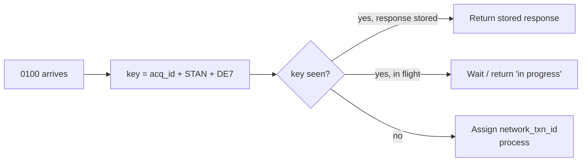

# 12: Design Decisions for `simple-network`

This document turns the previous eleven into decisions. Each one is written as a short ADR (architecture decision record): the context, the options, a recommendation, and **what would make you revisit it**. It maps to [PLAN.md](../PLAN.md) and answers its open questions.

## Decision summary

| # | Decision | Recommendation | Revisit when |
|---|---|---|---|
| D1 | Network model | Four-party, dual-message | Adding PIN debit → add single-message |
| D2 | Message format | ISO 8583-shaped JSON (DE-numbered fields) | Interop with real processors → add a binary codec at the edge |
| D3 | Transaction identity | Network-generated `network_txn_id` + idempotency on (acq ID, STAN, DE7) | Never |
| D4 | Transaction storage | Append-only event log + derived state | Volume needs a streaming log (Kafka-style) |
| D5 | Money | Integer minor units + ISO 4217, basis points for rates | Never |
| D6 | Ledger | Double-entry, append-only, zero-sum invariant | Never |
| D7 | BIN routing | In-memory range table, longest-prefix match, versioned | Millions of ranges → trie or interval tree |
| D8 | Timeouts and stand-in | Tiered timeouts. Decline (91) at first, with a STIP parameter model ready for later. | First stand-in approval feature |
| D9 | Reversals | Network sends 0420 as soon as its issuer timeout fires. Acquirers reverse on timeout. | Never |
| D10 | Clearing | Daily batch files with header/trailer controls, cycle IDs | Need for intraday cycles |
| D11 | Settlement | Net per (member, currency, cycle). Release only after the invariant check. | Multi-currency |
| D12 | Fees | Versioned table-driven rules engine, small initial table | Never (just grow the table) |
| D13 | Rules | Rules as versioned data, rule ID logged on every decision | Never |
| D14 | Participant trust | HMAC + nonce + timestamp, then mTLS | Moving off localhost |
| D15 | Card data | Own test BIN prefix, masked logs, CVV never stored, PAN in as few services as possible | Never |
| D16 | Products | Credit first. Funding source on the BIN from day one. Prepaid next. | Debit regulation work |
| D17 | Tokenization | Yes. In-switch vault done in M3; a separate token service is planned for M10. | |
| D18 | Testing | Certification harness + deterministic simulators + property tests on ledger invariants | |
| D19 | Observability | Per-hop latency, approval rate, and response-code mix from day one (feeds M8 dashboard) | |
| D20 | Time | All timestamps in UTC. Business date and cycle are explicit fields. Injectable clock. | |

---

## D1: Four-party, dual-message

**Context.** Networks are either four-party (Visa/MA) or three-party (Amex). Messaging is either dual-message (auth + clearing) or single-message.

**Decision.** Four-party, dual-message, as PLAN.md already says.

**Why.** Dual-message covers holds, tips, incremental auth, clearing tolerances, and interchange qualification. That is most of what makes credit cards hard. Single-message is a smaller subset you can add later.

## D2: ISO 8583-shaped JSON

**Options.** (a) Free-form JSON. (b) JSON named after ISO data elements. (c) Binary ISO 8583 from the start.

**Decision.** (b). Use field names like `de4_amount` and `de39_response_code`, and keep MTIs and response codes as defined by ISO.

**Why.** It is readable and easy to debug, and anyone from the industry can read it. A binary codec can be added later as an **edge adapter** without changing internal models.

**Do:** keep the schema in one shared package (`internal/iso8583`, already started) that every service imports, and give it a `schema_version`.
**Don't:** let each service invent its own field names.

## D3: Transaction identity and idempotency



- The **network** generates `network_txn_id` (UUIDv7 or ULID, which sort by time) and returns it in every response.
- All later messages (reversal, clearing, dispute, MIT) reference it.
- Duplicate requests must **never** create a second hold at the issuer.

## D4: Append-only event log

Store **events** (`AuthRequested`, `AuthResponded`, `ReversalRequested`, `Cleared`, `Settled`, `ChargebackFiled`, …), not mutable rows. The current state is a projection.

**Why.** Disputes and audits need a full history. Bugs can be fixed by replaying. This also matches PLAN.md's "immutable record of every message".

**SQLite note (`modernc.org/sqlite`):** one `events` table with `(network_txn_id, seq, type, payload_json, recorded_at)` plus projection tables is fine for a PoC. Write each event and its projection update in one transaction.

## D5 and D6: Money and ledger

- Amounts as `int64` minor units (as `AuthRequest.Amount` already does), currency as an ISO 4217 code, and rates in **basis points** (`int64`). Consider a small `money.Amount{Minor int64; Currency string}` type in `internal/money` so currencies can't be mixed by accident.
- Write rounding as one shared function, tested at the edges (half-up, per transaction).
- Double-entry ledger as in [05](05-clearing-and-settlement.md). **Invariant tests:** every journal entry balances, and every settlement cycle sums to zero across members plus network revenue.

```go
// Property test idea (testing/quick or a seeded random generator).
func TestSettlementIsZeroSum(t *testing.T) {
	for seed := int64(0); seed < 1000; seed++ {
		day := randomDayOfTransactions(rand.New(rand.NewPCG(uint64(seed), 0)))
		pos := settle(clear(day))
		var sum int64
		for _, m := range pos.Members {
			sum += m.NetMinor
		}
		if sum+pos.NetworkRevenueMinor != 0 {
			t.Fatalf("seed %d: settlement not zero-sum: %d", seed, sum+pos.NetworkRevenueMinor)
		}
	}
}
```

## D7: BIN routing

```go
// Longest-prefix match, loaded once, swapped atomically on change.
type BinEntry struct {
	Prefix        string // 6–8 digits
	IssuerID      string
	Product       string
	FundingSource string // credit | debit | prepaid
	Country       string
	TokenRange    bool
}

type BinTable struct{ byPrefix map[string]BinEntry }

func (t *BinTable) Lookup(pan string) (BinEntry, bool) {
	for n := min(8, len(pan)); n >= 6; n-- { // longest prefix wins
		if e, ok := t.byPrefix[pan[:n]]; ok {
			return e, true
		}
	}
	return BinEntry{}, false
}

// Hot-swap: var current atomic.Pointer[BinTable]; current.Store(newTable)
```

`internal/card.BIN` currently returns 6 digits (`BINLength = 6`). That is fine for display and masking, but let the routing table accept 8-digit prefixes so sub-ranges can override their parent.

- The table is versioned (`effective_from`). Updates swap the whole table atomically, so a lookup never sees a half-loaded table.
- Mark token ranges, funding source, product, and country.

## D8: Timeouts and stand-in

| Hop | Timeout budget (PoC defaults) |
|---|---|
| POS → Acquirer | 20 s |
| Acquirer → Network | 15 s |
| Network → Issuer | 5 s |

At first, on an issuer timeout: respond `91`, log it, and send a `0420` right away, so any hold the issuer placed (or places when it answers late) is released. Store per-issuer STIP parameters now (max amount, daily limits, MCC blocks) with `enabled=false`. Enabling stand-in approvals is then a config change plus the `0120` advice queue.

**Use a circuit breaker per issuer.** After N consecutive failures (timeouts, HTTP 503s, or connection errors), stop sending to that issuer and go straight to STIP/decline. After a cooldown the breaker goes half-open and lets one live request through as a trial; if it succeeds the breaker closes, otherwise it opens again. (Probing with `0800` echo messages instead of a live request is planned.)

## D9: Reversal rules

1. A late issuer response is **never forwarded**. The network sends a `0420` to the issuer as soon as its timeout fires (with its own DE11 and DE7, reason `68` in DE39, and the original in DE90), and retries it with capped exponential backoff (1 s doubling to 30 s) until the issuer acknowledges.
2. The acquirer sends a `0420` reversal advice to the network when it gets no response before its own timeout. The network (`POST /reverse`) acknowledges with an `0430` at once and forwards it to the issuer if the original was approved. If the `0420` arrives before the `0100`, the late `0100` is declined with `05`.
3. Reversals are idempotent and match on `network_txn_id` or DE90.
4. Reversal after clearing → reject with a "use refund" code.

## D10 and D11: Clearing and settlement cycles

```mermaid
gantt
    title One business day in simple-network (UTC)
    dateFormat HH:mm
    axisFormat %H:%M
    section Auth
    Real-time authorizations           :a1, 00:00, 24h
    section Clearing
    Acquirer files accepted            :c1, 00:00, 22h
    Cutoff + clearing run              :crit, c2, 22:00, 1h
    Outgoing issuer files              :c3, 23:00, 30m
    section Settlement
    Net positions + invariant check    :s1, 23:30, 30m
```



- `cycle_id = business_date + cycle_number`. Every clearing record belongs to exactly one cycle.
- File ingest uses header/trailer totals and file sequence numbers, and is idempotent by file hash.
- Settlement output: one settlement instruction per (member, currency), plus a detailed report each member can reconcile against.
- **For local runs, use an injectable clock** (a `Clock` interface with `Now()`) so a test can run "a whole day" in seconds (e.g., a `make run-day` target).

## D12 and D13: Fees and rules as data

Follow [06](06-economics-and-fees.md) and [10](10-rules-governance-and-regulation.md): ordered, versioned rule tables (`fees.yaml`, `tolerances.yaml`, `reason_codes.yaml`, `response_codes.yaml`). Every priced transaction stores `fee_program_id` and `rule_version`.

**Answer to PLAN.md's open question:** start with three interchange programs (card-present credit, card-not-present credit, default) plus flat network fees. Do not start with a single flat fee. The engine is what you are building, and its table can stay small.

## D14 and D15: Trust and card data

- Signed requests: `X-Participant-Id`, `X-Key-Id`, `X-Timestamp`, `X-Nonce`, `X-Signature = HMAC-SHA256(key, method|path|timestamp|nonce|sha256(body))`.
- Reject requests outside ±5 min clock skew or with a reused nonce.
- Card data:
  - Use your own fake prefix (e.g., `91xxxxxx`) and refuse real brand prefixes unless test mode is on. (The POS currently generates cards on `400000`, a well-known Visa test range. That's fine for now. Moving to a simple-network prefix makes it clear the cards are fake.)
  - Log PANs masked (`first6****last4`) or as an HMAC for correlation.
  - Accept CVV2 in the auth request, pass it to the issuer, and **drop it**. It is never written to disk.
  - Expiry and PAN go only to: the switch (in memory), the issuer, and later the token vault.

## D16 and D17: Products and tokenization

Answers to PLAN.md's open questions:
- **Credit only, or debit and prepaid?** Credit first. Put `funding_source` and `product` on BIN entries immediately. Prepaid is the best second product (partial auth, balance inquiry). Debit with single-message comes after that.
- **Tokenization?** Yes. A small in-switch token vault with a detokenize step shipped in M3. A standalone token service with its own database is planned for M10, after hardening (M9). It is the most valuable modern network service and good practice for keeping PAN handling in one place.

## D18: Testing strategy

| Layer | Tool | Examples |
|---|---|---|
| Unit | `go test` (table-driven) | Luhn, BIN lookup, fee rounding, response mapping |
| Property / fuzz | `testing/quick`, Go native fuzzing (`go test -fuzz`) | Ledger balances, settlement zero-sum, idempotency (same request N times = one hold), message parser robustness |
| Contract | Shared `internal/iso8583` types | Every service encodes and decodes the same structs |
| **Certification harness** | Scripted scenarios | Approve, decline, timeout, late response, duplicate, partial reversal, over-tolerance clearing, chargeback → representment |
| Chaos | Fault injection | Kill an issuer mid-day. Delay responses. Drop clearing files. |
| Load | A planned `cmd/pos` load mode, or `vegeta` / `k6` (PLAN M4/M9) | p99 latency, throughput limit per hop |

## D19: Observability (feeds the M8 dashboard)

The metrics that matter to a network operator:

| Metric | Why |
|---|---|
| Approval rate by issuer / MCC / entry mode | The first signal of trouble |
| Response code distribution | A spike in `91`/`96` means an outage; a spike in `05`/`59` means fraud or a bad rule |
| Per-hop latency p50/p95/p99 | Is it us or the issuer? |
| Timeouts, late responses, stand-in count | Issuer health |
| Unmatched clearing records / over-tolerance | Data quality |
| Settlement net position per member, and exposure vs limit | Settlement risk |
| Dispute ratio per merchant | Compliance |

## Anti-patterns to avoid

| Anti-pattern | Why it hurts |
|---|---|
| The switch reads the issuer's database "just for speed" | Breaks the four-party model and the security boundary |
| Floats for money | Rounding drift. Settlement won't zero out. |
| Mutable transaction rows | No audit trail. Disputes can't be reconstructed. |
| Exact-amount matching at clearing | Breaks on tips, hotels, fuel, split shipments |
| Hard-coded fees and rules in `if` statements | Cannot be versioned, audited, or changed safely |
| No idempotency | Retries create duplicate holds and duplicate charges |
| Forwarding late responses | Orphan holds, unhappy cardholders |
| Logging full PANs or CVVs | A PCI violation even in a PoC habit, and habits carry over |
| One shared database for all services | Hides integration bugs that real banks would hit |
| Wall-clock time in business logic | Untestable cutoffs and cycles |

## Suggested refinements to PLAN.md milestones

| Milestone | Add |
|---|---|
| M1 Data models | `network_txn_id`, money type, event types, BIN entry attributes, response-code registry with retry categories |
| M3 Network switch | Idempotency, per-issuer circuit breaker, `0420` on issuer timeout, signed requests |
| M5 Clearing | File header/trailer controls, MCC tolerance table, 1-to-many matching |
| M6 Settlement | Double-entry ledger, zero-sum invariant, exposure tracking |
| M7 Lifecycle | Dispute state machine with reason-code table and deadlines |
| M9 Hardening | Certification harness, chaos scenarios, STIP approvals |
| M10 (new) | Standalone token service (the in-switch vault + detokenize step shipped in M3) |
| M11 (new) | Prepaid product: partial auth, balance inquiry |

## Key takeaways

- Most correctness comes from a few non-negotiables: idempotency, append-only events, integer money, double-entry, and rules as data.
- PLAN.md's open questions: **table-driven fees (small table)**, **credit first with funding source modeled**, **tokenization yes (in-switch vault done in M3; standalone token service in M10)**.
- Build the certification harness and observability early. They make the PoC credible and make the M8 dashboard nearly free.

Next: [13: Glossary](13-glossary.md)
